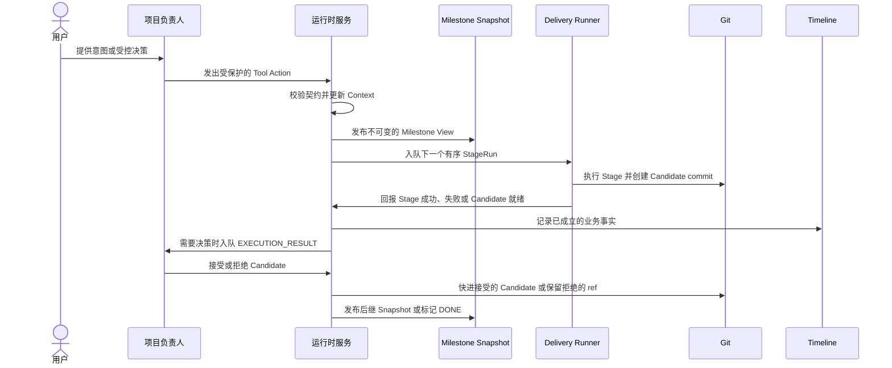

# AgentPlaneX 项目观测

先读取 `requirements.md`、`architecture.md` 和 `roadmap.md`，理解长期有效的项目意图。它们是规格文档，不是运行时当前状态。

以启动时提供的 `triage_id`、角色、工作树和固定工作对象为起点。固定的 Stage、Snapshot、Plan commit 或 Candidate 不得被更新后的运行时对象悄然替换。

## 核心流程

`project_runtime_context` 回答项目现在在哪里。Snapshot、StageRun 和 Git 回答哪些计划与代码事实已经存在。Timeline 解释重要的历史事实；它不重建当前状态，也不负责调度工作。

在解释 Timeline payload、SQLite 关系、状态值或开展角色相关调查前，阅读 [references/detail.md](references/detail.md)。只读查询 SQLite 和 Git。所有状态变化必须经过运行时的 Tool 或受控命令，禁止直接编辑 SQLite、Git ref 或证据文件。
