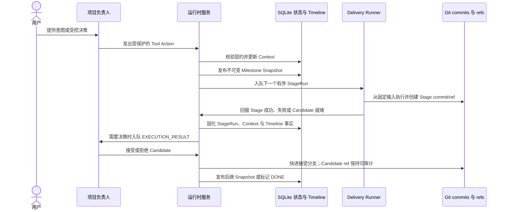
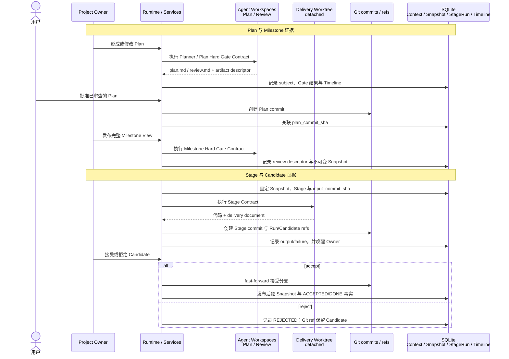

# AgentPlaneX 项目观测

先读取 `requirements.md`、`architecture.md` 和 `roadmap.md`，理解长期有效的项目意图。它们是规格文档，不是运行时当前状态。

以启动时提供的 `triage_id`、角色、工作树和固定工作对象为起点。固定的 Stage、Snapshot、Plan commit 或 Candidate 不得被更新后的运行时对象悄然替换。

始终成对审计 SQLite 与 Git：SQLite 证明控制面状态、对象关系和已记录的业务事实；Git 证明 Spec、代码、交付文档、commit 可达性与 ref 身份。`.agentplanex/agent-workspaces/` 中的 Agent artifact 是由 SQLite artifact descriptor 锚定的辅助证据，不是第三个独立状态权威。

## 核心流程



`project_runtime_context` 回答项目现在在哪里。Snapshot、StageRun 和 Git 回答哪些计划与代码事实已经存在。Timeline 解释重要的历史事实；它不重建当前状态，也不负责调度工作。

## 核心证据产出时序

使用下图回答“某项证据何时产生、保存在哪里、如何与另一侧交叉验证”。图中的“接受分支”通常是 `main`：Plan 审批时先以项目目标 Worktree 当前附着的分支为准，Rolling Delivery 开始后再以 `project_runtime_context.git_branch` 固定。

先用下面的文件树建立空间直觉。它表示“Plan 已批准、已有 Agent 审计 artifact、当前 Run 正在执行一个 Stage”时可能出现的中途切片；`{...}` 是示意 ID，不保证每个目录在所有状态下都存在。

```text
<project>/                                      # 目标 Git Worktree，附着在接受分支
├── architecture.md                             # 当前 Worktree 的 Spec
├── requirements.md
├── roadmap.md
├── src/ ...                                    # 接受分支当前代码
├── docs/agentplanex/deliveries/
│   └── {accepted_run_id}/ ...                  # 只包含已经进入接受分支的历史交付文档
└── .agentplanex/                                # Runtime-owned；其中 DB/Agent artifact 不进入目标分支
    ├── agentplanex.sqlite3                     # Context / Snapshot / StageRun / Timeline
    ├── agent-workspaces/
    │   ├── {planner_workspace_id}/             # Planner 的持久 workspace
    │   │   ├── workspace.json
    │   │   ├── documents/plan.md               # Planner Task artifact；不自动进入接受分支
    │   │   └── outbox/{invocation_id}/result.json
    │   └── {reviewer_workspace_id}/            # 每次 Hard Gate 使用的隔离 workspace
    │       ├── workspace.json
    │       ├── inputs/milestones.json          # 仅 Milestone Gate 需要时出现
    │       ├── documents/review.md              # Gate 审计 artifact；不进入接受分支
    │       └── outbox/{invocation_id}/result.json
    └── delivery-worktrees/
        └── {active_run_id}/                     # 从 StageRun.input_commit_sha 建立的 detached worktree
            ├── .git                            # 指向主仓库的 linked-worktree 元数据
            ├── architecture.md                  # 固定输入 commit 中的完整项目树
            ├── requirements.md
            ├── roadmap.md
            ├── src/ ...                        # 当前 Stage 正在产生的代码变更
            └── docs/agentplanex/deliveries/
                └── {active_run_id}/
                    └── {stage_key}.md           # Stage Contract 要求的交付文档

Git 逻辑对象与 refs（不要依赖 `.git/refs` 的物理文件布局）：

接受分支（通常 main） ----------------------> {git_main_version}
refs/agentplanex/runs/{active_run_id} --------> {latest_successful_stage_commit}  # 已有成功 Stage 时
refs/agentplanex/candidates/{active_run_id} ---> {final_stage_commit}              # 最终 Stage 完成后
```

区分这两个 Worktree：目标 Worktree 在 Candidate 决策前仍停留于 `git_main_version`；当前 Run 的未接受代码和交付文档先出现在 detached Delivery Worktree，成功后进入 Stage commit/ref，只有 Candidate 被接受后才可从接受分支看到。Candidate 就绪或 Stage 失败后，Delivery Worktree 可以被清理，因此不要把它当成持久审计证据。



按以下边界解释图中的产物：

| 证据位置 | 会出现什么 | 不应推断什么 |
|---|---|---|
| 项目 Worktree | 审批前可变的三份 Spec，以及当前接受分支检出的文件 | 未提交 Spec 不是已批准 Plan；工作树当前内容不能替代历史 commit |
| `.agentplanex/agent-workspaces/<workspace>/` | Planner 的 `documents/plan.md`、Hard Gate 的 `documents/review.md`、每次 Task/Gate 的 `outbox/<invocation>/result.json` | 该目录被 Git 排除；不要声称这些文档位于 `main`，也不要仅凭文件存在证明 Gate 结果 |
| 接受分支历史 | 通过用户批准提交的三份 Spec；接受 Candidate 后的代码和每个 Stage delivery document | Planner `plan.md`、Hard Gate `review.md` 和被拒 Candidate 不会因此进入接受分支 |
| `refs/agentplanex/runs/<run_id>` | 某次 Run 最新成功 Stage 的 commit | 该 ref 不表示 Candidate 已被接受 |
| `refs/agentplanex/candidates/<run_id>` | 最终 Stage Candidate；接受或拒绝后仍保持 Git 可达性 | ref 存在不表示 Candidate 位于接受分支；必须检查决策 Timeline 和分支可达性 |
| SQLite | 当前 Context、不可变 Snapshot、StageRun 输入/输出、Activation/Message、Timeline 及 artifact descriptor | 当前指针为空不表示历史对象不存在；Timeline 也不能替代 Git 对象或当前状态表 |

核心审计只要求闭合三条证据链：

| 审计对象 | 最小闭环 |
|---|---|
| Plan / Gate | `subject_digest` → `review.md` descriptor → `plan_commit_sha` |
| Stage / Delivery | Snapshot 与 `input_commit_sha` → Stage commit/ref → 代码 diff 与 delivery document |
| Candidate 决策 | Candidate ref → 接受/拒绝事实 → 接受分支可达性与后继 Snapshot |

先用 Context 定位“现在”，再用不可变 SQLite 行和 Git 对象解释“如何到达”。任何单个当前指针、Timeline 事件或 workspace 文件都不足以独立完成归因；若 Timeline 缺失，明确记录证据缺口，不要据此推翻已经成立的 SQLite 终态或 Git 事实。

在解释 Timeline payload、SQLite 关系、状态值或开展角色相关调查前，阅读 [references/detail.md](references/detail.md)。只读查询 SQLite 和 Git。所有状态变化必须经过运行时的 Tool 或受控命令，禁止直接编辑 SQLite、Git ref 或证据文件。
