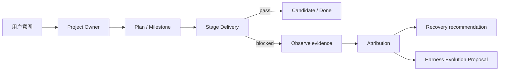
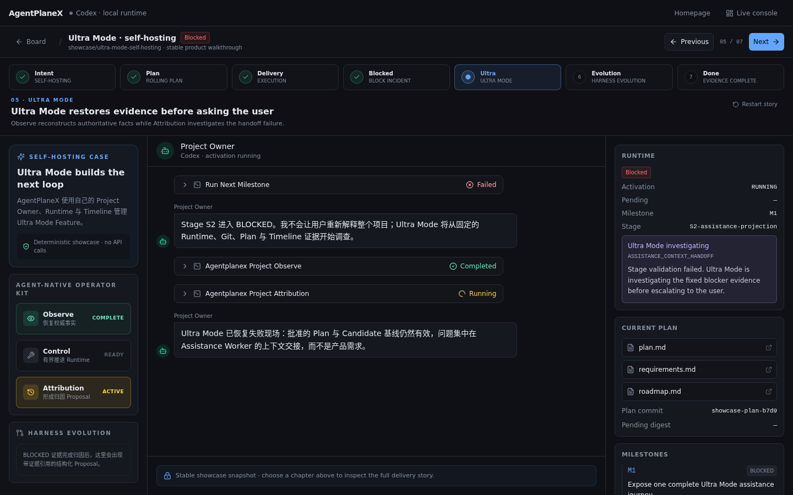
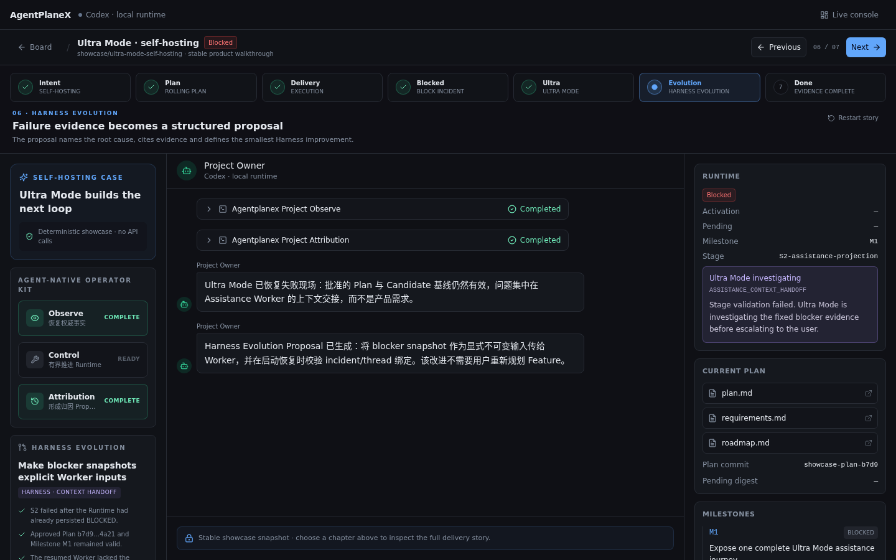
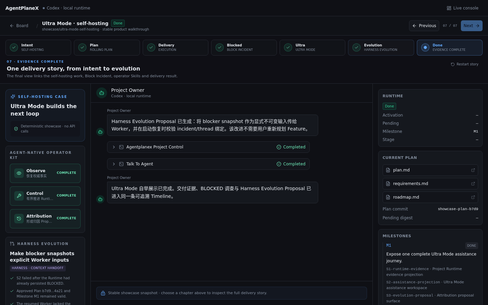

# AgentPanelX

> The autonomous harness orchestrator for long-running coding tasks.

AgentPanelX 是一块本地优先的 Kanban 控制台，用于运行跨越数小时甚至数天的 Coding Tasks。Codex 等 CLI Coding Agent 在独立 Git worktree 中执行；基于 mini-swe-agent 的 Project Owner 代理用户持续规划、推进和恢复交付。

[查看产品演示](#静态交互演示) · [快速开始](#快速开始) · [系统架构](docs/architecture.md) · [Agent Skills](docs/skills.md)


## 为什么需要 AgentPanelX

Coding Agent 已经擅长写代码，但长周期项目中，用户往往还在手工承担 Harness 的工作：反复解释目标、催促下一步、判断计划是否可信、恢复中断现场，并在失败后重新拼接上下文。

AgentPanelX 把这部分工作变成一个可持续运行、可观察、可追溯的项目 Runtime：

- **Project Owner 与 Rolling Planning**：维护用户意图和对话记忆，协调 Planner、Reviewer 与执行 Agent，把下一步变成明确的 Plan / Milestone / Stage。
- **Plan → Execution → Replan**：以 Contract 驱动交付；Plan、Milestone Snapshot、Stage Run 和 Candidate 都有明确状态与校验入口。
- **可观察 Web Console**：在同一 Workspace 展示 Project Owner 对话、Tool input/output、Runtime、Plan、Git 与 Timeline；Board 同时呈现等待审批、执行中、阻塞和完成状态。
- **BLOCKED 恢复与 Harness Evolution**：固定失败现场，先恢复证据、再归因，把“为什么卡住”沉淀成带证据引用的结构化 Proposal。
- **Agent-Native 操作面**：Observe、Control、Attribution 三个 Skill 分别负责观测、介入与归因，并共享同一 Runtime 权限边界。

## 一条完整的展示闭环

当前仓库内置一个确定性、脱敏的 Self-hosting Showcase：AgentPanelX 使用自己的 Project Owner、Runtime 和 Timeline 管理 Ultra Mode Feature，并展示一次 Stage 从执行、BLOCKED 调查到 Harness Evolution Proposal 的完整过程。



| 阶段 | 页面能够直接验证的证据 |
| --- | --- |
| Intent / Plan | Project Owner 回复、Planner Tool、Plan 文档、审批摘要 |
| Delivery | 运行中的 Tool Step、Milestone / Stage、Git snapshot、Timeline |
| Blocked / Ultra | 失败 Tool output、固定 Block Incident、Observe / Attribution 状态 |
| Evolution / Done | 根因分类、证据引用、结构化 Proposal、Review 结果 |



## 三个 Agent-Native Skill

Observe、Control、Attribution 将同一个 Project Runtime 暴露给开发 Agent：

| Skill | 输入 | 能力 | 输出与边界 |
| --- | --- | --- | --- |
| [Observe](.codex/skills/agentplanex-project-observe/SKILL.md) | Project / Feature / Triage | 恢复 Runtime、Git、Plan、Milestone、Stage 与 Timeline 事实 | 只读事实与证据索引；不改变状态 |
| [Control](.codex/skills/agentplanex-project-control/SKILL.md) | 明确授权的项目和动作 | 驱动 Activation、发送消息、审批或拒绝 Plan、启动 / 推进 Delivery | 只经过真实 Runtime；不直接写 SQLite 或 Git ref |
| [Attribution](.codex/skills/agentplanex-project-attribution/SKILL.md) | 已进入 BLOCKED 的历史现场 | 恢复证据并在检查点 fork 只读 Historical Project Owner，通过质询与反思定位系统性缺口 | 带证据引用的统一 Proposal；不直接解除阻塞 |

详细的使用场景和权限关系见 [Agent-Native Operator Kit](docs/skills.md)。

## 静态交互演示

构建前端后，打开 `http://127.0.0.1:13475/showcase`，或先观看 [53 秒流程录像](docs/assets/showcase/demo.webm)。该入口不调用模型、不读取用户项目，也不发起 `/api` 请求：

- 默认先显示包含 Triage、Todo、Ready、In Progress、Blocked 与 Done 的静态 Board；
- `WAITING_APPROVAL`、`BROKEN_STAGE` 和 Assistance 状态会像真实项目一样同时出现；
- 点击卡片进入重点 Self-hosting Workspace；
- 可以切换 Intent、Plan、Delivery、Blocked、Ultra、Evolution、Done 七个章节；
- 可以展开 Planner、Reviewer、Bash、Observe、Control、Attribution 的输入与输出；
- 可以查看 Plan 文档、Milestone、Git snapshot 和 Timeline payload。

Showcase 复用生产 Web Console 组件和状态语义，但使用独立的确定性数据，不写入 `.agentplanex` 数据库。实现与事实边界见 [Showcase 说明](docs/showcase.md)。

<p align="center">
  
  
</p>

## 快速开始

### 环境要求

- Python 3.12
- [`uv`](https://docs.astral.sh/uv/)
- Node.js 与 npm
- Linux 上可用的 `bwrap`（Project Owner Bash 的写入与网络隔离边界）
- 一个已经存在目标分支 commit 的本地 Git 仓库

### 安装并启动

```bash
uv sync

cd frontend
npm install
npm run build
cd ..

uv run agentplanex-web
```

打开：

- 中文官网：`http://127.0.0.1:13475`
- Web Console：`http://127.0.0.1:13475/console`
- 静态 Showcase：`http://127.0.0.1:13475/showcase`
- OpenAPI：`http://127.0.0.1:13475/docs`

FastAPI 在 13475 端口同时提供构建后的 React SPA 和同源 `/api`，因此生产式本地启动只需要一个端口。前端热更新开发方式见 [frontend/README.md](frontend/README.md)。

### 模型配置

默认配置位于 [`config/settings.yaml`](config/settings.yaml)。模型凭据只从配置声明的环境变量读取，不应写入仓库。没有模型凭据时，仍可浏览 Showcase、读取已注册项目和运行默认离线测试；真实 Project Owner Activation 需要可用的 OpenAI-compatible gateway。

## 架构概览

```text
React Web Console
      │ same-origin /api + silent polling
FastAPI Workspace API
      │
WorkspaceService ── WorkspaceWorker
      │
Feature ProjectRuntime
      ├── Project Owner / Planning / Delivery
      ├── EventBus ── Timeline projection
      ├── Git worktree / Plan commits / Candidate refs
      └── project-local SQLite / Messages / Snapshots / Stage runs
```

关键设计边界：

- 每个 Feature 绑定独立 managed worktree，业务决策与 Git / 文件系统副作用分层；
- EventBus 同步记录执行事实，但不改变业务结果；Web Console 通过静默轮询读取稳定投影；
- Plan 与 Milestone Hard Gate 对精确 subject digest 审查，结果不匹配时 fail closed；
- `.agentplanex/` 保存数据库、trajectory 与 transcript，并通过目标仓库的 `.git/info/exclude` 排除出业务 commit；
- Project Owner Bash 使用 Bubblewrap 限制持久写入与网络访问；它不是保密沙箱。

完整组件关系、交付时序与 BLOCKED 调查路径见 [架构文档](docs/architecture.md)。

## 当前事实边界

为了让公开展示与代码事实一致，仓库将能力分为三层：

- **Runtime 已实现**：项目注册、Feature worktree、Project Owner Activation、Plan / Milestone Hard Gate、Stage Delivery、SQLite / Git 证据、Timeline、Web Console 和静默轮询。
- **Showcase 已实现**：无需后端的静态 Board 与完整 Self-hosting Workspace，稳定展示 Tool activity、Ultra 调查和 Harness Evolution Proposal。
- **继续生产化**：让 Ultra Mode 自动调度独立 Assistance Worker，并将 Proposal 自动应用、重放和验证。当前公开演示不伪造不存在的外部执行、测试或 commit。

## 开发与验证

```bash
uv run pytest
uv run ruff check .
uv run mypy

cd frontend
npm run check
npm run lint
npm run build
```

默认测试不访问模型网络。需要凭据的 live model smoke 必须显式运行：

```bash
uv run pytest -m live_model tests/live/test_live_supervisor.py
```

调试 Project Owner Tool 时，使用真实 Runtime 入口，不直接修改 SQLite：

```bash
uv run python scripts/debug_tool_cli.py \
  --cwd .agentplanex/tests/<case> \
  --print \
  '{"tool":"bash","arguments":{"command":"pwd"}}'
```

## 开源协作

- [贡献指南](CONTRIBUTING.md)
- [安全说明](SECURITY.md)
- [MIT License](LICENSE)
- [系统架构](docs/architecture.md)
- [Showcase 说明](docs/showcase.md)
- [Agent Skills](docs/skills.md)

AgentPanelX 当前处于 `0.1.0` 展示与验证阶段。已知限制和后续能力以仓库文档与 Release 为准，不以演示数据替代真实运行结果。
