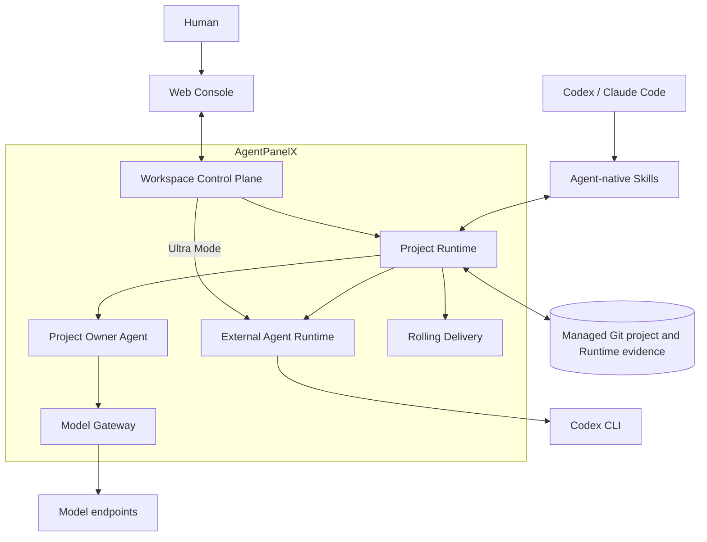

# AgentPanelX

<p align="center">
  
</p>

<h3 align="center">Autonomous Harness Orchestrator</h3>

<p align="center">
  AgentPanelX 是面向长周期 Coding Projects 的本地优先控制平面。<br />
  Project Owner 维护目标、滚动规划、恢复中断交付，并将执行历史沉淀为 Harness Evolution 证据。
</p>

<p align="center">
  <a href="https://aowo-1345.github.io/AgentPanelX/"><strong>官方网站</strong></a>
  ·
  <a href="https://aowo-1345.github.io/AgentPanelX/console"><strong>体验 Console</strong></a>
  ·
  <a href="docs/architecture.md">系统架构</a>
  ·
  <a href="README.md">English</a>
</p>

<p align="center">
  <a href="https://github.com/aowo-1345/AgentPanelX/actions/workflows/ci.yml"></a>
  <a href="LICENSE"></a>
  
  
  
</p>

## v0.2 — 让滚动交付持续向前

AgentPanelX v0.2 从“能够协调执行”继续走向可承载真实长周期交付的本地控制平面：

- 优化的本地模型网关：支持通过 OpenAI-compatible 本地代理使用 [**OpenAI 订阅账号**](docs/chatgpt-local-auth.zh-CN.md)，在多次 Activation 之间保持 Project Owner 上下文与 Cache Affinity，并将网关超时和异常沉淀为明确的 Runtime 证据。
- **Task Distributor 与滚动 Milestone：** 不在开始时冻结一份穷尽所有细节的路线图，而是持续规划近期可执行范围；交付后再进入质量加固阶段，评估代码质量，视证据进行行为保持式重构并记录 QA 结果。
- **Ultra Mode：** 当交付从 `IN_PROGRESS` 进入 `BLOCKED`，AutoCodex 使用绑定的 Observe、Control 与 Attribution Skills 判断既有意图是否足以继续。明确的问题会让 Project Owner 回到滚动交付；确实无法定夺的问题继续保持阻塞，并产出归因报告与 Historical Owner 反思。

## Agent-native 上手方式

如果你已经在使用 Codex 或 Claude Code，可以直接让 Coding Agent 帮你安装、验证并讲解 AgentPanelX：

```text
请在本地安装 AgentPanelX，并验证 Web Console 能够正常启动。然后向我解释
Project Owner、Project Runtime、Git worktree，以及 Observe / Control / Attribution
三个 Skill 如何协同工作。以仓库文档作为事实来源；如果缺少依赖，请明确报告，
不要猜测或跳过验证。
```

在 Codex 或 Claude Code 中打开这个仓库，发送上面的请求，并让 Agent 始终在仓库根目录工作。不使用 Coding Agent 时，也可以按照[快速开始](#快速开始)手动安装。


## AgentPanelX 做什么

这套 Runtime 提供四项相互连接的核心能力：

| 核心能力 | 作用 |
| --- | --- |
| **Project Owner 滚动交付** | 维护用户意图，跨越 Plan、Milestone 与 Stage 协调 Planner、Task Distributor、Reviewer 和 Coding Agent。 |
| **隔离执行** | 每个 Feature 使用独立 Git branch 与 worktree，多个 Coding Agent 不共享工作目录。 |
| **可观测 Runtime** | 在同一 Web Console 展示对话、推理、Tool 输入输出、审批、Git、Plan 与 Timeline。 |
| **恢复与 Harness Evolution** | 保留 BLOCKED 证据，恢复失败上下文，并将反复出现的交付缺口沉淀为结构化 Proposal。 |

## 系统上下文



Web Console 通过 Workspace 控制面进入系统，仓库 Skills 则为 Coding Agent 提供同一 Feature Runtime 的 Agent-native 入口。Project Runtime 协调持久化 Project Owner、External Agent Runtime 与滚动交付；Owner 通过共享 Model Gateway 访问模型，Planner、Task Distributor、Reviewer、Hard Gate、Stage Executor 与 AutoCodex 统一经 External Agent Runtime 和 Codex 执行。代码与持久 Runtime 证据仍锚定在受管 Git 项目中。详细模块和生命周期见[架构文档](docs/architecture.md)。

## Agent-native 操作面

Web Console 面向人，三个仓库级 Skill 则把同一个 Project Runtime 暴露给 Codex 和其他兼容的 Coding Agent：

| Skill | 能力 | 边界 |
| --- | --- | --- |
| [Observe](.codex/skills/agentplanex-project-observe/SKILL.md) | 恢复 Runtime、Plan、Git、Milestone、Stage 与 Timeline 事实。 | 只读；不审批，也不推进执行。 |
| [Control](.codex/skills/agentplanex-project-control/SKILL.md) | 发送消息、批准或拒绝 Plan、启动 Delivery，并执行授权范围内的 Runtime 动作。 | 只经过真实 Runtime；不直接修改 SQLite 或 Git ref。 |
| [Attribution](.codex/skills/agentplanex-project-attribution/SKILL.md) | 恢复 BLOCKED 检查点，fork 只读 Historical Project Owner，通过质询与反思形成 Harness Evolution Proposal。 | 只读归因；不直接解除阻塞。 |

完整工作流和权限模型见 [Agent-native 操作说明](docs/skills.md)。

## 快速开始

### 环境要求

- Python 3.12
- [`uv`](https://docs.astral.sh/uv/)
- Node.js 与 npm
- Git
- Linux 上的 Bubblewrap（`bwrap`）
- 真实交付时至少需要一个受支持的 CLI Coding Agent

### 安装并启动

```bash
git clone https://github.com/aowo-1345/AgentPanelX.git
cd AgentPanelX

uv sync
cd frontend && npm ci && npm run build && cd ..

uv run agentplanex-web
```

打开 `http://127.0.0.1:13475`。

FastAPI 在同一个端口提供 React 页面和同源 `/api`。只有真实 Project Owner Activation 需要模型凭据；凭据从 [`config/settings.yaml`](config/settings.yaml) 声明的环境变量读取。

## 架构

```text
React Web Console
      │ same-origin /api + silent polling
FastAPI Workspace API
      │
WorkspaceService ── WorkspaceDispatcher
      │
Feature ProjectRuntime
      ├── Project Owner / Planning / Delivery
      ├── EventBus ── Timeline projection
      ├── Git worktree / Plan commits / Candidate refs
      └── project-local SQLite / Messages / Snapshots / Stage runs
```

每个 Feature 绑定一个 managed worktree 和项目本地 SQLite Runtime。Dispatcher 在配置上限内并行执行不同 Feature，同时保证单个 Feature 互斥；它不维护等待队列，启动时也不自动续跑中断工作。Git 与文件系统副作用和业务决策保持分层；Plan 与 Milestone Gate 校验精确 subject；EventBus 记录执行事实，但不成为第二份状态来源。

组件边界、消息时序、交付 Contract、轮询投影与 BLOCKED 归因路径见[系统架构](docs/architecture.md)。

## 开发验证

```bash
uv run pytest
uv run ruff check .
uv run mypy

cd frontend
npm run check
npm run lint
npm run build
```

默认测试不会访问模型网关。仓库协作约定和 Project Owner Tool 调试方式见[贡献指南](CONTRIBUTING.md)。

## 文档

- [系统架构](docs/architecture.md)
- [Agent-native 操作说明](docs/skills.md)
- [通过本地代理接入 ChatGPT 订阅](docs/chatgpt-local-auth.zh-CN.md)
- [Console 使用说明](docs/showcase.md)
- [贡献指南](CONTRIBUTING.md)
- [安全说明](SECURITY.md)
- [MIT License](LICENSE)
