# AgentPanelX 架构

AgentPanelX 是一个面向长周期 Coding Tasks 的本地优先交付运行时。它以 Project Owner 作为用户代理，将目标维护、滚动规划、审查、隔离执行、人工决策与失败归因组织到同一个 Project Runtime 中，并通过 Kanban Console 与 Agent-native Skills 暴露可观察、可介入、可追溯的项目控制面。

## 1. 架构目标

系统围绕四个约束设计：

1. **长期目标不依赖单次对话。** 用户意图、Rolling Summary、Plan、Milestone 与执行历史均可恢复。
2. **规划与执行有明确 Contract。** Project Owner 负责推进，Planner、Task Distributor、Reviewer 和 Coding Agent 在固定输入、输出与权限边界内协作。
3. **所有执行都能回到同一现场。** 对话、Tool activity、Stage、Git、Runtime 状态与 Timeline 共同构成 Workspace projection。
4. **失败进入下一轮系统优化。** Observe 恢复事实，Control 推进恢复，Attribution 复盘历史 Project Owner 上下文并形成 Harness Evolution Proposal。

## 2. 系统上下文

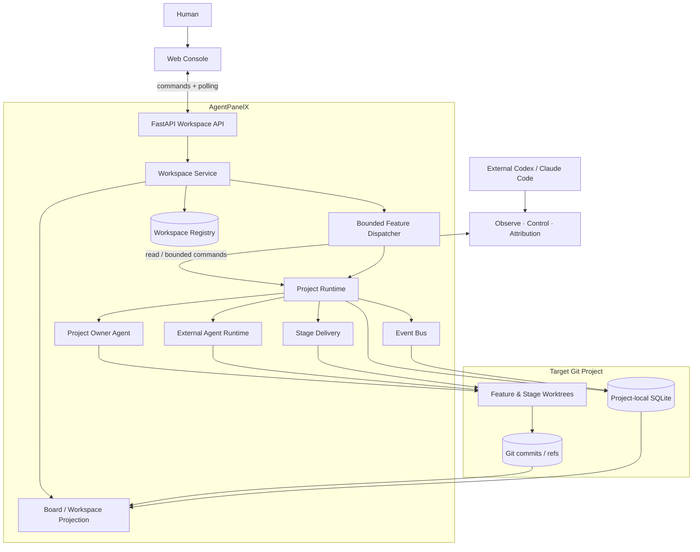

Web Console 与外部 Coding Agent 是同一个 Runtime 的两个操作入口：浏览器适合持续观察和人工决策；Skills 让 Codex 或 Claude Code 在终端中读取证据、执行有边界的控制动作，或复盘一次历史失败。

## 3. 运行时分层

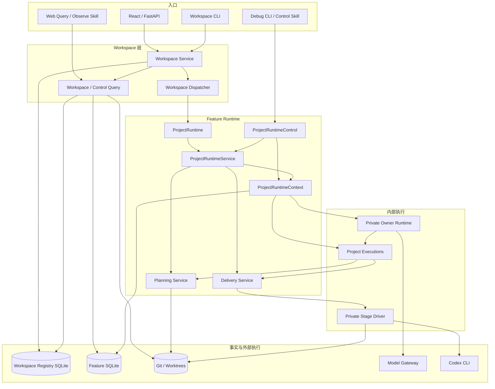

系统有三条入口：正常命令走 `ProjectRuntime`，人工单步介入走
`ProjectRuntimeControl`，只读观察走 Query。三者共享 SQLite/Git 事实，但不共享接口。

`ProjectRuntimeService` 只协调 `Context / Planning / Delivery`；
`ProjectRuntimeContext` 负责 Feature State、Owner Activation、事务与执行互斥。

`PlanningService` 处理 Plan 决策，`DeliveryService` 处理 Milestone、Stage 与 Candidate。
Project Owner 通过 `ProjectExecutions` 调用它们，不直接接触数据库或 Git adapter。

Bootstrap 根据 `active_model` 的显式 `adapter` 配置构造唯一 `ModelGateway`。Gateway 保持
`ResponsesTransport.create` 边界，在 Workspace 的所有 Feature Runtime 间共享所选 Adapter
及其惰性 SDK Client/连接池，并由 Workspace 关闭生命周期统一释放。Qwen Adapter 保留现有
非流式 Responses、SDK 重试与异常归一化语义，不发送或解释缓存控制字段。Gateway 只在一次
逻辑调用的最外层写一条安全的 Token/耗时事件；Loguru 是应用级基础设置，文件按日期写入
全局 `.logs/` 并保留三天，日志失败不改变模型调用结果。

同一个 Gateway 也可以显式绑定通用 OpenAI Responses Adapter；`base_url` 决定它连接官方
Endpoint 还是用户管理的兼容本地代理，Bootstrap 不探测、不动态切换、也不做跨 Adapter
回退。Runtime 从持久化的 `project_owner_session_id` 按 Owner 与 Summary 两种用途分别派生
稳定的不透明 affinity，并只放入当前 `ResponsesRequest`。OpenAI Adapter 将它映射为
`prompt_cache_key`，Qwen Adapter 忽略它；该值不成为新的 SQLite 或 Web Contract。Provider
返回缓存 usage 时，Gateway 记录对应 Token 数，但不记录 affinity、Prompt、Response、Tool
内容、call ID、request ID 或凭据。

Tool 参数仍由同一 Pydantic Contract 在 Runtime 强制校验；面向严格函数调用的 Provider
Schema 会展开带 sibling metadata 的本地 `$ref`，无法由 OpenAI JSON Schema 子集表达的
跨集合约束仅作为描述提供，不能取代执行前的 Runtime 校验。已完成的 Responses output 在
下一轮作为 input 重放时会移除输出态 `status`，同时保留 Tool `call_id` 关联。

Planning、Delivery 与 Project Runtime Context 各自在 `models.py` 中持有自己的纯业务模型；
SQLite Repository 只依赖这些无副作用模型。跨越多个能力的 Runtime State、Execution Event
与状态变更原因继续由 `domains/` 承载。

`drive_until_waiting()` 持续推进可自动执行的 Owner 或 Delivery 工作，并在审批、人工
Tool、Owner 回复、`BLOCKED`、`DONE` 或空闲时返回。

## 4. 权威数据与读写边界

AgentPanelX 不使用单个状态对象描述整个项目。不同事实由最适合它的存储负责，再由查询层组合为用户看到的 Workspace。

| 事实 | 权威来源 | 主要写入方 | 前端呈现 |
| --- | --- | --- | --- |
| Project identity、Feature binding、worktree 路径 | Workspace Registry SQLite | Workspace Service / Registry | Project / Feature navigation |
| 用户意图、Owner 回复、Tool activity | SQLite Message History | ProjectRuntimeContext 内部 Owner Runtime | Conversation |
| Owner 运行状态与失败 | SQLite Owner Activation | ProjectRuntimeContext | Runtime / Conversation |
| Rolling Summary 与 Owner 上下文 | SQLite Message / Summary History | Project Owner Runtime adapter | Owner ContextManager |
| Feature 状态、pending action、Plan identity | SQLite `project_runtime_state` | Runtime / Planning / Delivery | Board / Runtime |
| Plan 文档与批准版本 | Git working tree + Plan commit | Project Owner / Planning | Plan panel / Git |
| Milestone、Stage 与 Candidate | SQLite snapshot + Git refs | Delivery Service | Milestones / Runtime / Git |
| 代码变更 | Feature / Stage worktree 与 Git commit | Coding Agent / Stage Executor | Git panel |
| 状态到达路径 | SQLite Timeline | EventBus recorder | Timeline |

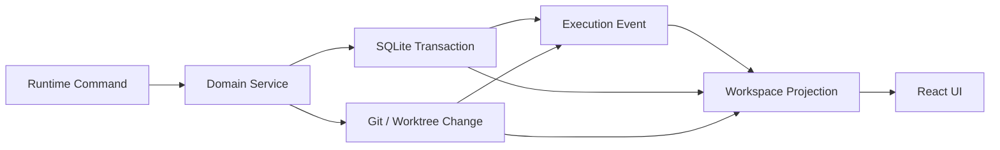

Workspace Registry 与 Feature Runtime 数据库是两个层次：前者只保存 Project identity 和
Feature-to-worktree binding；后者由每个 Feature 独立持有 State、Message、Activation、
Snapshot、StageRun 与 Timeline。Dispatcher 的准入状态只存在于 Web 进程内，不新增调度表。
Git 负责需要版本语义的交付事实。受管 Feature 的 command graph 组合时会先将
`.agentplanex/` 写入目标仓库的 `.git/info/exclude`，再创建 Runtime Schema，避免
Runtime 数据进入业务 commit。
任何操作都必须经过 Runtime 与 Service；直接修改 SQLite 或 Git ref 不属于受支持的控制路径。

## 5. 核心链路一：从目标到 Project Owner Activation

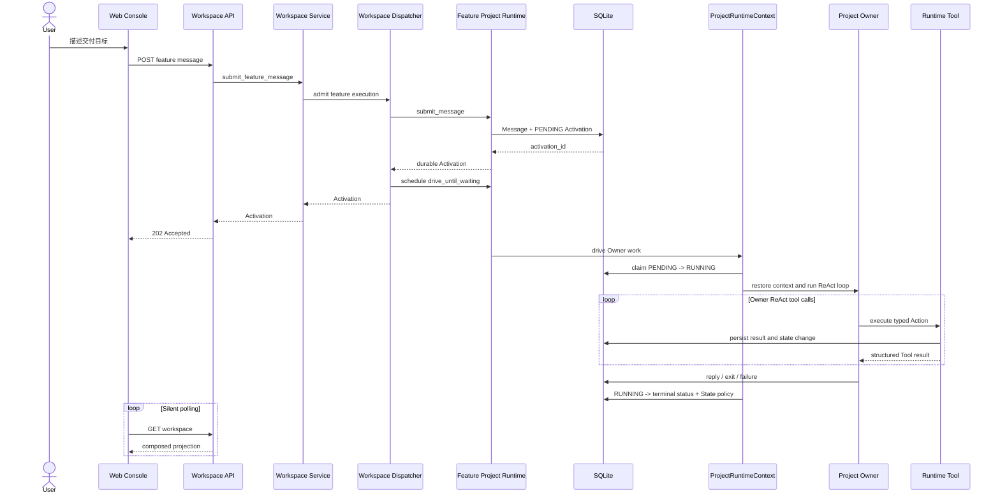

API 在命令已持久化且后台执行已提交后返回 durable receipt，不等待模型完成。
Activation 的 `PENDING → RUNNING → terminal` 状态独立持久化，因此网页可以同时
呈现 Owner 正在运行、具体 Tool step、最终回复或失败原因。若 Web 进程中断，下一次
启动只把遗留未完成的 Activation 或 StageRun 归并为 `FAILED + BLOCKED`，不自动续跑。

模型驱动的 Activation 在构造 Owner Agent 时调用 `OwnerContextManager.restore()`，按
Activation 固定的 Message/Summary 检查点恢复；此后每次模型查询都先调用
`prepare_query()` 渲染并计算完整请求 token。超限时，ContextManager 依次通知 Runtime
记录 `CONTEXT_COMPACTION_STARTED`、生成并校验双 Summary、请求 CAS 提交，提交成功后
才切换内存投影并记录 `COMPLETED`；失败则记录 `FAILED` 并继续使用冻结的原始上下文。
手工 `TOOL` 驱动按设计绕过模型查询和这套压缩流程，只复用 Activation、消息持久化、
Tool 执行与 ReAct Timeline。

## 6. 核心链路二：滚动规划与 Hard Gate

### External Agent Runtime

Project Owner 之外的 Planner、Reviewer、Task Distributor、两个 Hard Gate 与 Stage
Executor 共享唯一调用入口 `ExternalAgentRuntime.invoke()`。业务模块只提交 Runtime 生成的
request identity、受管 scope 和角色强类型 payload；不能提交 Prompt、Skill 路径、thread、
workspace 或任意输出 schema。

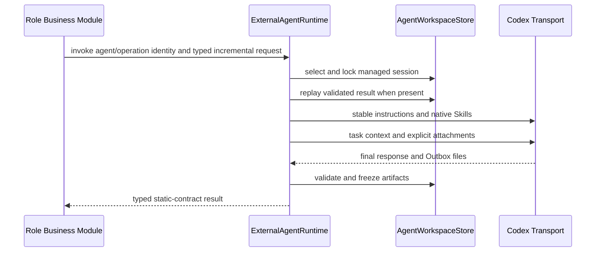

稳定 Definition 来自 `resources/external_agents/*.md` 和 `runtime.external_agents` 配置；每次
Activation 只包含本轮任务、小型 Runtime Context、明确附件和本轮输出位置。Planner 与 Task
Distributor 分别按 Feature 自动恢复 Session，Reviewer 与两个 Gate 每次独立，Stage Executor
按 StageRun 恢复。调用方不接触 `conversation_id`。Codex thread、request、已验证结果和冻结
Artifact 存在 `.agentplanex/agent-workspaces/`，不增加 External Agent SQLite 生命周期表；只有
匹配 request digest 的合法结果可重放。Definition 与所有已注册 Operation 的实现和 schema
共同构成 Session protocol digest；业务调用方不能在 Activation 时替换它们。Codex 只获得
`workspace/` 子目录的写权限，Runtime 管理的 Session 元数据、固定输入与冻结 Artifact 位于该
写根之外。发布 URI 指向 `artifacts/<activation-id>/...` 的不可变字节，读取时复核路径、大小和
digest。无法确认已超时进程终止时，旧 Session 被 quarantine；等待锁的调用方取得锁后再次检查
fence，并改用新 workspace/thread，避免竞争 turn。

Project Owner 在 Feature worktree 中维护 `requirements.md`、`architecture.md` 与 `roadmap.md`。Plan Approval 不是一个松散按钮，而是围绕精确 subject identity 的受保护转换。

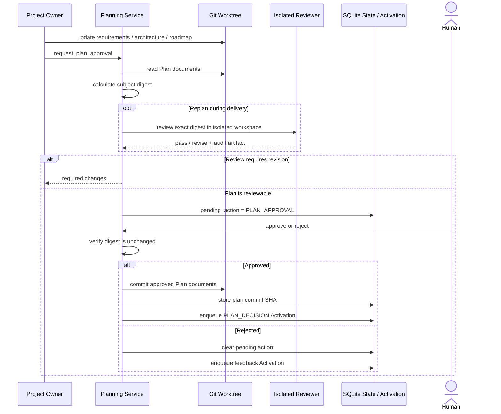

Planning 先把文档字节冻结为不可变 subject，再复制到 Reviewer 的隔离 workspace；批准时还会从 Git commit 重新读取同一 subject。Subject digest 因而将“人批准的内容”“Reviewer 审查的内容”和“最终提交的内容”绑定为同一个对象。文档在等待批准期间发生变化、Reviewer 输出不完整、subject 不匹配或审查执行失败时，Hard Gate 拒绝继续推进。Plan State 转换与 `PLAN_DECISION` Owner Input 在同一个 Context transaction 中提交。

Milestone View 使用相同设计：完整 Milestone 集合与当前 Plan commit 形成固定审查对象，Reviewer 在隔离 workspace 中返回结构化 manifest 和审计 artifact。

Plan 获批、首次发布 Milestone View 前，以及每个 Candidate 被接受、准备启动下一个不同
Milestone 前，Project Owner 会咨询 Task Distributor。Task Distributor 是一等外部 Agent，
使用自己的 Feature Session，在 workspace 生成并冻结 `documents/milestone-plan.md` 作为建议；它不
发布 Milestone，也不替 Owner 决策。建议保留完整 View 与 completed history，只细化第一
个未完成 Milestone，远期 Milestone 保持粗粒度。Stage 数量不固定，普通任务写入自然语言
objective；纯只读验证不单独成为 Stage，质量 Stage 仅在预计会形成有意义的项目或测试变更
时成立。

## 7. 核心链路三：隔离执行与 Candidate 决策

下图从首次 Start 已获用户批准或后续 Milestone 已明确入队开始，不重复上一节的人工审批门。

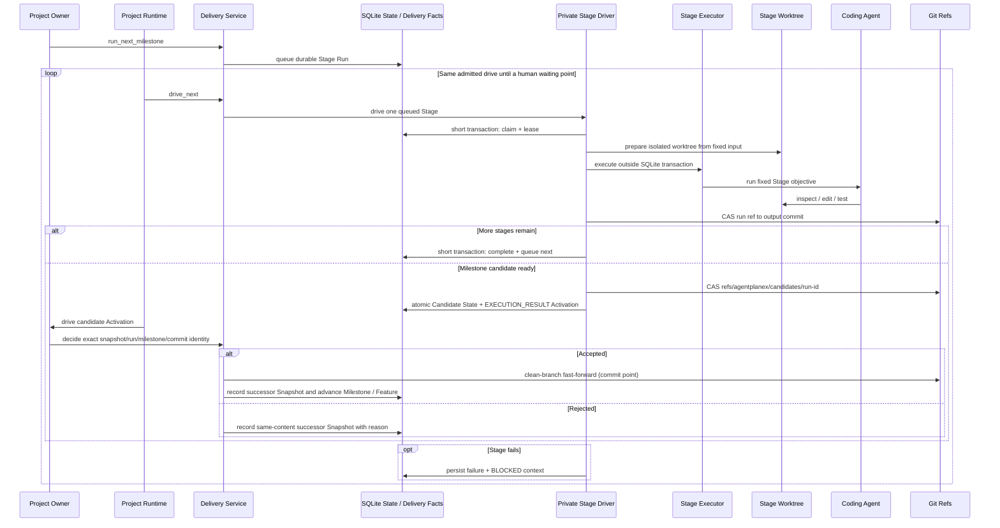

`ProjectRuntime.drive_until_waiting()` 只通过 Delivery 的 `active_work()` 与
`drive_next()` 协调交付，不接触 StageRun Repository、Executor、worktree 或 ref。
私有 Driver 把每次执行分成短事务领取、事务外长时间执行、短事务终结三个阶段。
Run ref 表示该 Run 最近一次已物化的输出；Candidate 只有在最终事务同时提交 State 与
Owner Activation 后才成为权威业务事实。若该事务失败，Stage 先进入 `FAILED + BLOCKED`，
Candidate ref 再按期望 SHA 尝试清理；清理失败只留下可审计的孤立 ref，不会伪造成功。
若进程中断，下一次启动会把遗留工作终结为 `FAILED + BLOCKED`，不会跨进程自动续跑。

Candidate 决策必须携带完整的 `snapshot_id + run_id + milestone_key +
candidate_commit_sha` 身份，并同时匹配 Runtime State、Snapshot、完整 StageRun 链和
Candidate ref。接受和拒绝都要求受控 Feature 分支且工作树干净；拒绝还要求 HEAD 仍在
固定 baseline。接受时 Git fast-forward 是跨 Git/SQLite 流程的提交点：若随后 SQLite
提交失败，Runtime 进入 `BLOCKED`，保留 Candidate 事实，并允许使用同一身份重复接受来
完成状态滚动，而不能改为拒绝。拒绝只提交 SQLite，并创建一个内容相同、携带拒绝原因与
Owner message checkpoint 的后继 Snapshot。决策结果只返回业务收据和 Snapshot id，
不会把持久化 Snapshot 实体泄漏到 Runtime 编排层。Run/Candidate refs 在决策后作为历史
证据保留；回收属于独立的未来策略。这里不声称 Git 与 SQLite 具有跨存储原子性。

## 8. Feature 生命周期

### Ultra Mode AutoTakeover

启用 `runtime.auto_takeover.enabled` 后，Runtime 将一次真实、已持久化的
`IN_PROGRESS → BLOCKED` 先视为待判定检查点。Dispatcher 结束原来的 drive 并释放
Feature occupancy 与 Runtime lock 后，`AutoTakeoverService` 才创建独立后台任务；Codex
运行期间不持有上述锁或 SQLite transaction。底层 Feature State 在接管判断期间保持
`BLOCKED`，直到真实 Control 操作改变它。

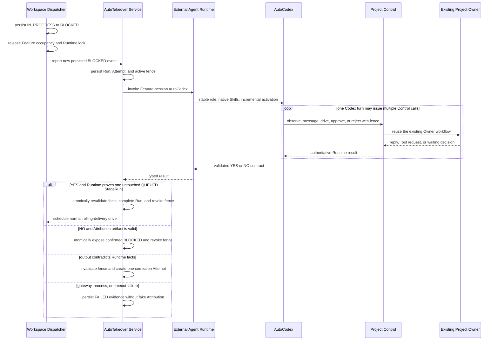

AutoCodex 是共享 External Agent Runtime 中的 Feature-session 角色，稳定绑定 Observe、
Control 与 Attribution；每次 Activation 只给出本次 BLOCKED event、剩余预算和 Runtime
签发的命令前缀。它通过和人类相同的 Planning/Delivery 入口作决定，不直接写 SQLite 或
Git ref，也不能直接 `drive-delivery`；Stage claim 始终由后续 Dispatcher continuation
负责。BLOCKED 下 `run_next_milestone` 只创建 `BLOCKED_RUN_APPROVAL`；批准时 Runtime
在同一事务重新校验 Plan、Snapshot、失败游标、Git 基线与活动 fence，然后恢复
`IN_PROGRESS` 并只入队一个 StageRun。

Takeover 的业务 Run、最多两个 Attempt 和 fence 存在 Feature SQLite；Codex Session、
请求、结果与不可变 Artifact 仍只存在 Agent Workspace。`YES` 必须匹配
`IN_PROGRESS + exactly one untouched QUEUED StageRun`；`NO` 必须匹配 `BLOCKED` 且 Attribution
Artifact 通过 size/digest 校验。第一次不一致只在同一 Feature Session correction 一次，
第二次不一致、技术故障或 1800 秒预算耗尽均终结为 `FAILED`，不会生成伪归因。

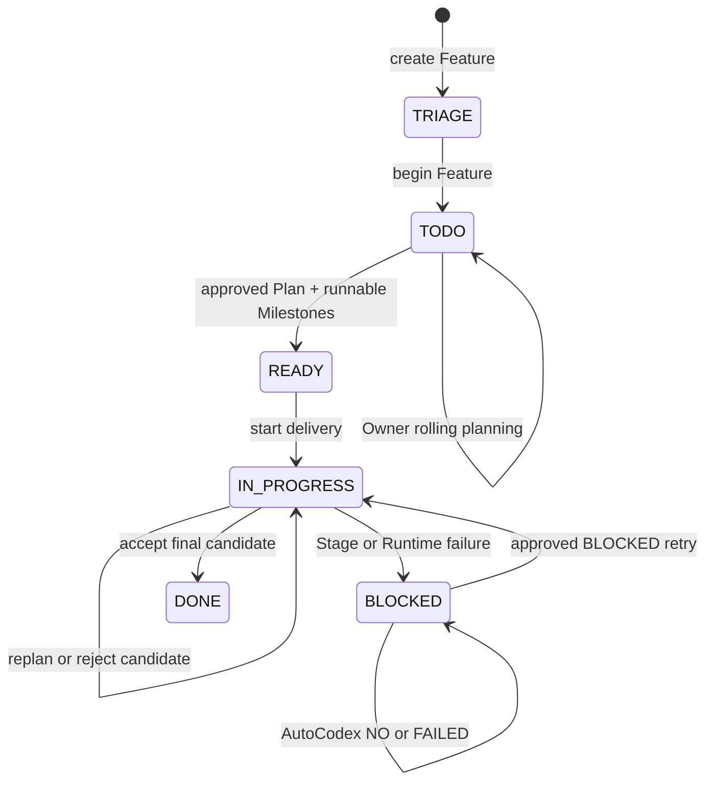

Kanban 状态只是 Project Runtime 的高层投影。`pending_action`、Activation status、Milestone state、Stage run 和 Candidate SHA 提供更细的控制信息，因此一个 `TODO` 卡片仍可能明确显示 `WAITING: PLAN_APPROVAL`。

## 9. EventBus、Timeline 与前端投影

EventBus 是同步的进程内事实分发器。领域服务完成状态转换后发布 `ExecutionEvent`，SQLite Timeline recorder 将其保存为可查询证据。Event handler 的失败会被记录，但不会反转已经成功提交的业务决策。

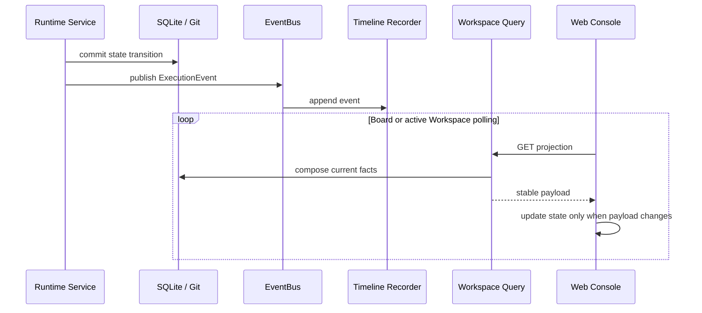

当前浏览器采用分层静默轮询：Board 使用较低频率，打开的 Workspace 在 Activation 或 Delivery 活跃时提高刷新频率。旧数据在请求期间保持可见，只有 payload 实际变化时才更新 React state，因此不会因轮询反复清空页面。未来若接入 SSE 或 WebSocket，稳定的推送边界仍应是 Workspace projection 或 event cursor，而不是让每个领域服务直接管理浏览器连接。

Workspace projection 一次组合以下信息：

- Project Owner 对话、回复与可展开 Tool activity；
- Runtime status、pending action 与 Activation；
- Plan 文档与审批状态；
- Milestone、Stage、Candidate 与当前交付进度；
- Feature branch、worktree 与 Git commit；
- Timeline 中的状态转换和 Agent invocation。

## 10. Agent-native Skills

三个 Skill 不是三套平行状态，而是同一个 Project Runtime 上的三种操作权限。

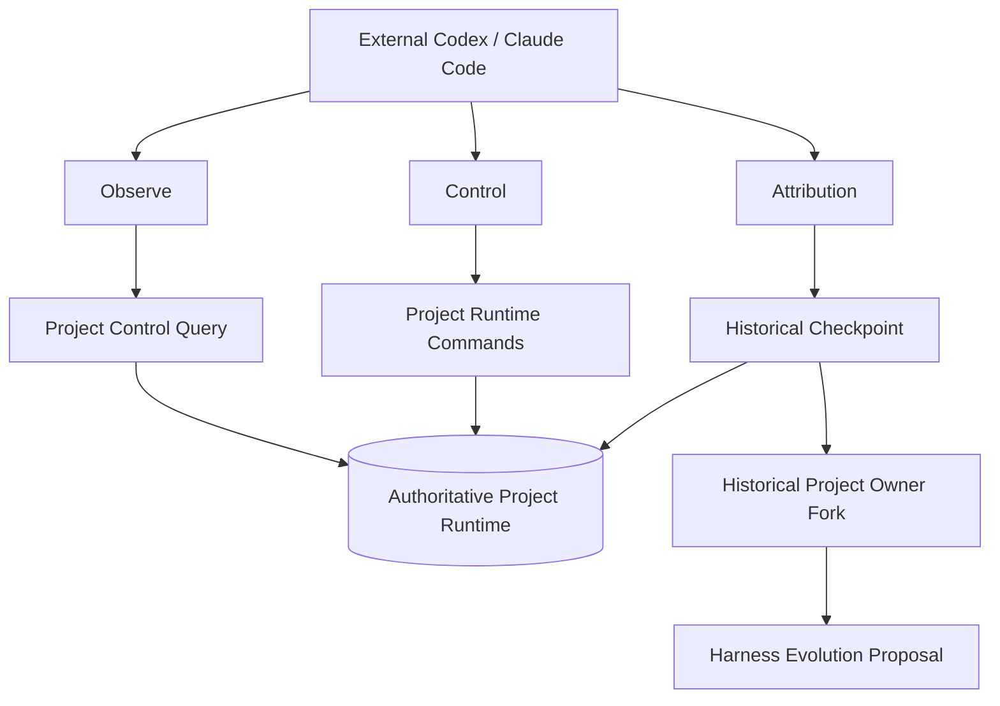

### Observe

只读恢复指定 Feature 的 Project Runtime、Message History、Plan、Milestone Snapshot、Stage Run、Git 与 Timeline，回答“项目现在在哪里”和“它如何到达这里”。

### Control

通过特权 `ProjectRuntimeControl` 执行有边界的单步命令：驱动 Owner Activation、发送消息、批准或拒绝 Plan、开始 Milestone、推进一个 Delivery step。它不是第二套 Runtime 状态机：共享业务命令委托 `ProjectRuntimeService`，Owner 生命周期命令委托同一个 `ProjectRuntimeContext`，且不持有 Repository、Runner、Executor 或 Git。另行创建的 Runtime 与 Control 实例通过同一 SQLite/Git 事实和 `runtime.lock` 协作，而不是共享进程内对象。`view` 独立构造只读 `ProjectControlQuery`，不获取 operation lock，也不构造 Owner/Responses 命令图。

### Attribution

以 BLOCKED 检查点为锚点，恢复当时的 Owner Context、Rolling Summary、Plan、Message Store、Milestone 与 Delivery evidence；随后 fork 一个只读 Historical Project Owner，对当时的判断、上下文和协作过程进行质询与反思，最终汇总为 Harness Evolution Proposal。

## 11. Harness Evolution 闭环

```mermaid
flowchart LR
    Delivery[Long-running Delivery]
    Blocked[BLOCKED Checkpoint]
    Evidence[Observe: recover evidence]
    Reflection[Attribution: fork and question Historical Owner]
    Diagnosis[Cross-role diagnosis]
    Proposal[Harness Evolution Proposal]
    Change[Runtime / Prompt / Contract improvement]
    Replay[Future delivery validation]

    Delivery --> Blocked
    Blocked --> Evidence
    Evidence --> Reflection
    Reflection --> Diagnosis
    Diagnosis --> Proposal
    Proposal --> Change
    Change --> Replay
    Replay --> Delivery
```

归因对象不是单条报错，而是 `planning → execution → blocked` 的完整证据链。Proposal 可以定位到规划 Contract、上下文交接、Reviewer 输入、Stage 执行、Runtime 恢复或工程 Harness 的具体缺口，使一次交付失败成为后续交付系统的改进输入。

## 12. 并发、恢复与安全边界

- **有界 Feature 并行：** 单 Web 进程内的 Dispatcher 默认允许 4 个不同 Feature 自动执行；同一 Feature 始终互斥，满载请求立即拒绝且不进入队列。
- **定向执行：** 只有新接受的用户命令会驱动其目标 Feature；启动时不扫描并自动执行旧任务。
- **Durable Activation：** Message 与 Activation 原子创建；启动时遗留的 `PENDING` 或 `RUNNING` Activation 会终结为 `FAILED`，不会自动重新执行。
- **Durable Stage：** Stage claim、输出 commit、Candidate ref 与完成状态分别持久化；启动时遗留的 `QUEUED` 或 `RUNNING` StageRun 会终结为 `FAILED + BLOCKED`，后续只能由显式新动作重新排队。
- **Fenced AutoTakeover：** 每个接管 Attempt 只有一个活动 fence；所有 Control mutation 在业务写入的同一 SQLite transaction 中复核 fence，Attempt 失效或终结时原子撤销。
- **有界自动恢复：** 每个真实 BLOCKED event 只创建一个 Takeover Run；结果不一致最多 correction 一次，AutoCodex turn 最长运行 1800 秒。
- **续跑交接：** `YES` 只在同一 SQLite transaction 中复核 Run、Attempt fence、State 和 queued StageRun 并终结结果；随后使用普通 Workspace Dispatcher 继续滚动交付，不增加第二套 Stage 执行入口。
- **隔离工作区：** Feature、per-activation Reviewer / Gate 和 StageRun 使用独立 worktree 或 workspace，降低并行 Agent 相互覆盖的风险。
- **Runtime 管理 Session：** 外部 Agent 调用方不管理 thread；同一 Session 的文件锁覆盖完整 Codex turn，危险超时会隔离旧 Session。
- **不可变 Agent Artifact：** `documents/` 可继续编辑；只有按 Activation 冻结并通过 digest 校验的 Artifact 才能跨 Agent 使用。
- **Fail-closed Hard Gate：** digest、manifest、artifact 或 Reviewer Contract 任一不满足即停止推进。
- **本地优先：** Web host 限制为 `127.0.0.1` 或 `localhost`；模型凭据只从环境变量读取。
- **受限 Shell：** Project Owner Bash 通过 Bubblewrap 限制持久写入范围并创建无网络 namespace；它是本地执行边界，不等同于多租户保密沙箱。
- **受管删除：** 只删除 AgentPanelX 管理且不活跃的 worktree，保留 Git branch，并保护真实项目与运行中 Feature。

## 13. 主要代码入口

| 关注点 | 入口 |
| --- | --- |
| FastAPI 与 SPA host | `src/agentplanex/web/app.py` |
| Project / Feature Registry | `src/agentplanex/infrastructure/workspace_registry.py` |
| Workspace commands 与准入 | `src/agentplanex/services/workspace/service.py`, `dispatcher.py` |
| Workspace read projection | `src/agentplanex/services/workspace/queries.py`, `services/web/project_workspace.py` |
| 正常 Project Runtime facade / composition / 协调 | `src/agentplanex/project_runtime/runtime.py`, `composition.py`, `services/project_runtime.py` |
| 特权单步 Runtime Control | `src/agentplanex/project_runtime/control.py` |
| Project Runtime Context 与内部 Owner Runtime | `src/agentplanex/services/project_runtime_context/` |
| Owner Activation lifecycle | `src/agentplanex/services/project_runtime_context/_activation.py` |
| Owner Tool Contract 与执行 | `src/agentplanex/project_owner_agent/tools/base.py`, `project_runtime/executions/` |
| Owner model context / Rolling Summary | `src/agentplanex/project_owner_agent/context/`, `services/project_runtime_context/_owner.py` |
| Planning 与 Plan identity | `src/agentplanex/services/planning/` |
| Project Owner / Historical Owner Invocation | `src/agentplanex/services/agent_invocation.py` |
| 外部 Agent 统一调用、Session 与静态 Contract | `src/agentplanex/services/external_agent_runtime/`, `infrastructure/agent_workspace.py`, `infrastructure/codex.py` |
| Owner A2A Planner / Reviewer / Task Distributor | `src/agentplanex/services/agent_collaboration/` |
| Plan / Milestone Hard Gate | `src/agentplanex/services/planning/_plan_hard_gate.py`, `services/delivery/_milestone_hard_gate.py` |
| Delivery 状态机与私有 Stage 执行 | `src/agentplanex/services/delivery/` |
| Ultra Mode AutoTakeover 与静态结果协议 | `src/agentplanex/services/auto_takeover/`, `infrastructure/sqlite/repositories/auto_takeover.py` |
| EventBus 与 Timeline | `src/agentplanex/services/event_bus.py`, `infrastructure/sqlite/timeline.py` |
| Model Gateway、Provider Adapter 与应用日志 | `src/agentplanex/infrastructure/model_gateway/`, `infrastructure/logging.py` |
| Git / worktree 基础设施 | `src/agentplanex/infrastructure/git_repository.py`, `workspace_git.py`, `agent_workspace.py` |
| React Board / Workspace | `frontend/src/pages/BoardPage.tsx`, `WorkspacePage.tsx` |
| Agent-native Skills | `.codex/skills/agentplanex-project-observe/`, `agentplanex-project-control/`, `agentplanex-project-attribution/` |

## 14. 单端口部署

生产构建由 FastAPI 在同一个端口同时提供 SPA 与 `/api`：

```text
Browser
  ├── GET /, /console, /projects/...  -> React SPA
  └── /api/...                       -> FastAPI Workspace API
```

开发模式下 Vite 提供前端热更新，并把 `/api` 代理到 FastAPI。两种模式共享相同的 React 页面、Workspace schema 与业务 API。
