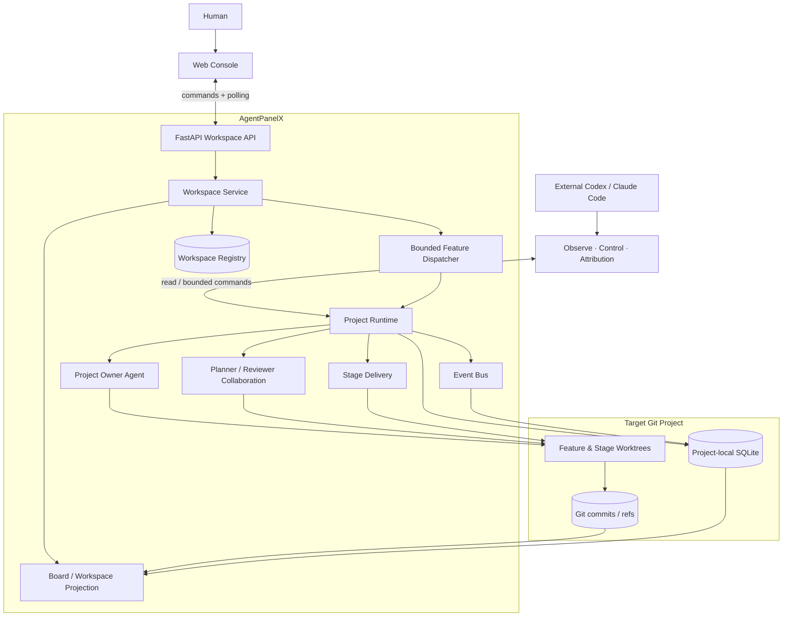
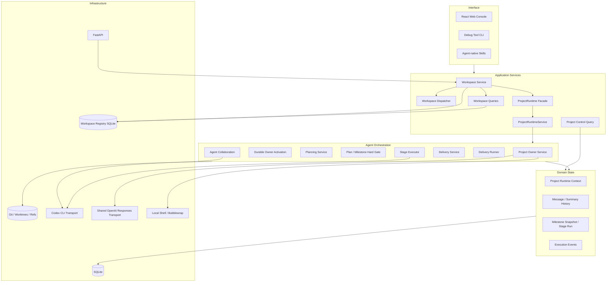
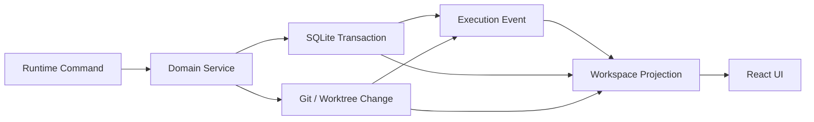
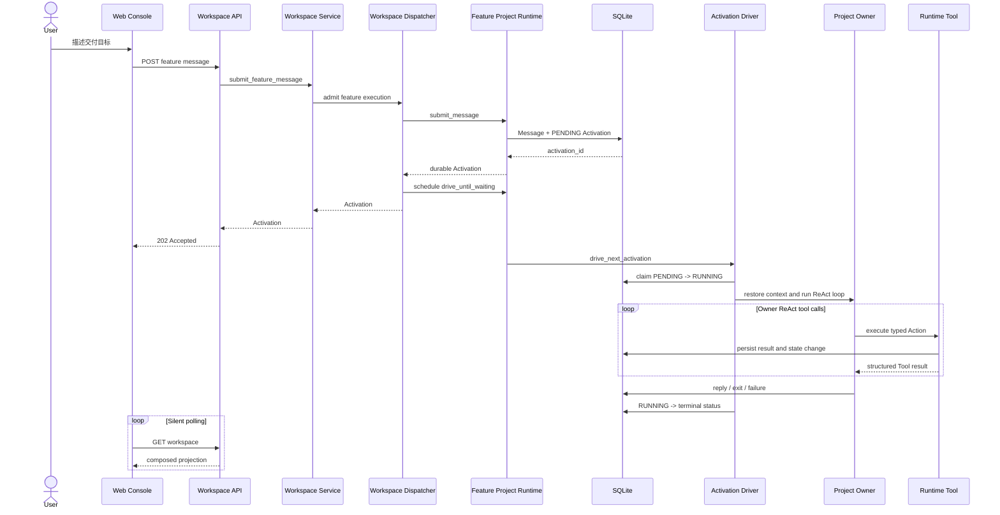
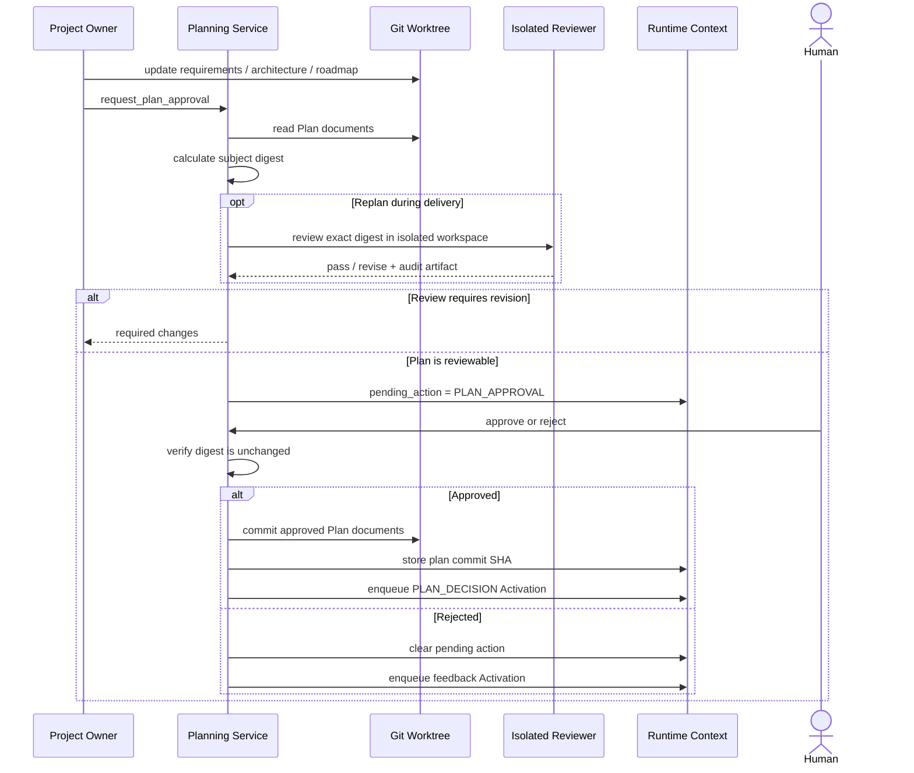
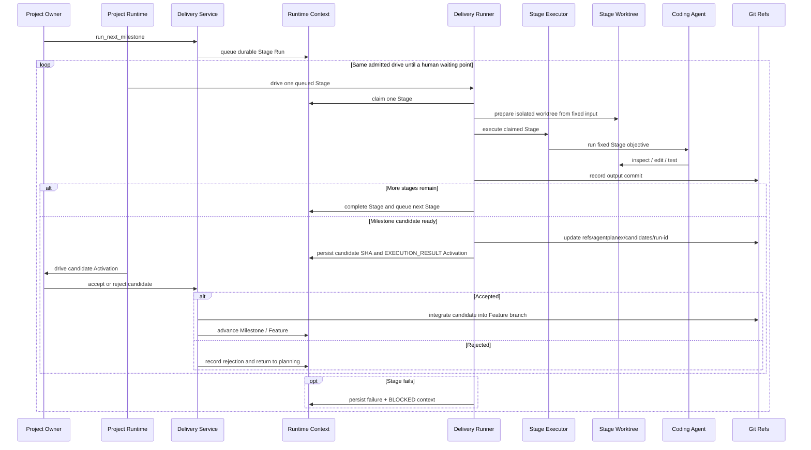
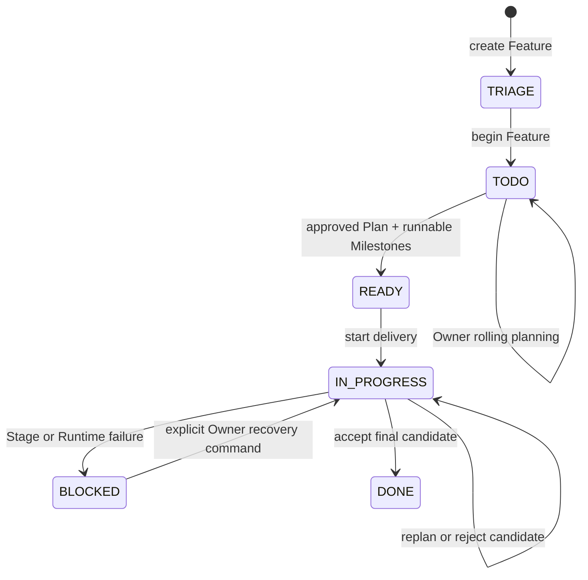
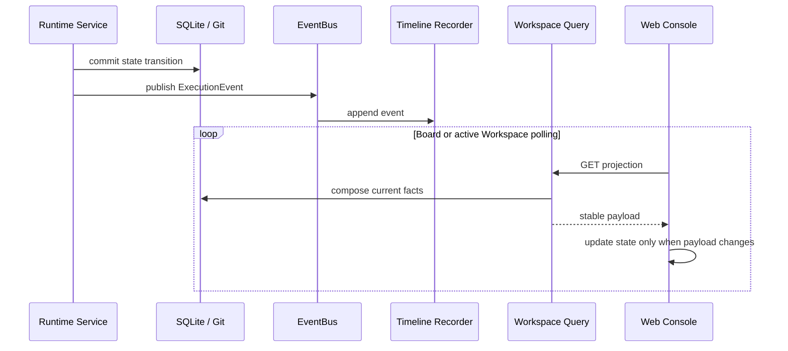
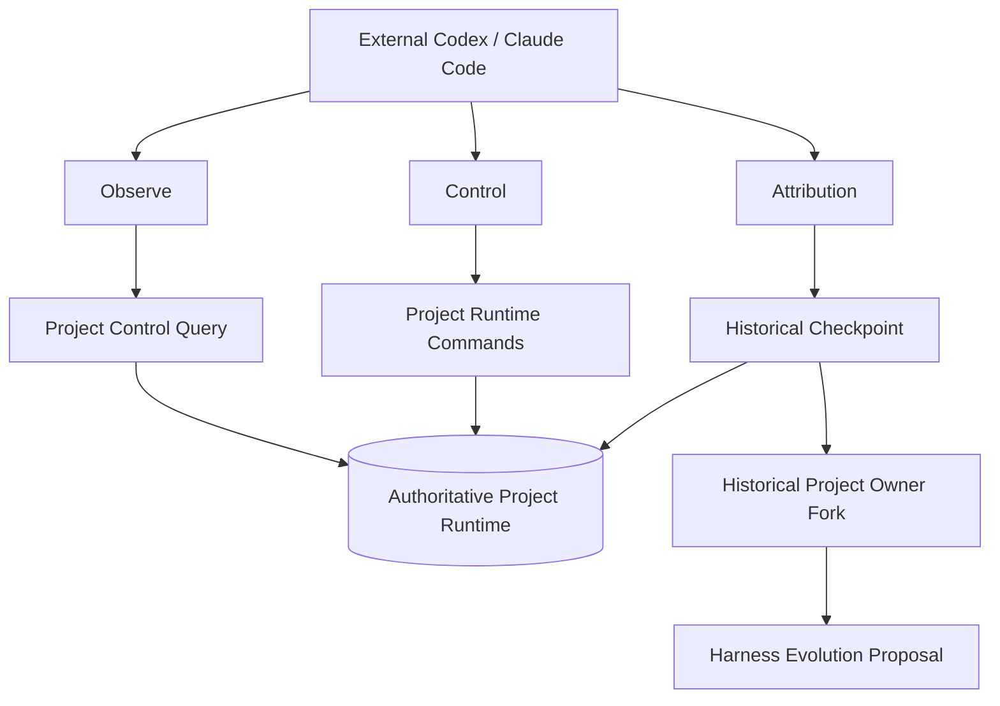

# AgentPanelX 架构

AgentPanelX 是一个面向长周期 Coding Tasks 的本地优先交付运行时。它以 Project Owner 作为用户代理，将目标维护、滚动规划、审查、隔离执行、人工决策与失败归因组织到同一个 Project Runtime 中，并通过 Kanban Console 与 Agent-native Skills 暴露可观察、可介入、可追溯的项目控制面。

## 1. 架构目标

系统围绕四个约束设计：

1. **长期目标不依赖单次对话。** 用户意图、Rolling Summary、Plan、Milestone 与执行历史均可恢复。
2. **规划与执行有明确 Contract。** Project Owner 负责推进，Planner、Reviewer 和 Coding Agent 在固定输入、输出与权限边界内协作。
3. **所有执行都能回到同一现场。** 对话、Tool activity、Stage、Git、Runtime 状态与 Timeline 共同构成 Workspace projection。
4. **失败进入下一轮系统优化。** Observe 恢复事实，Control 推进恢复，Attribution 复盘历史 Project Owner 上下文并形成 Harness Evolution Proposal。

## 2. 系统上下文



Web Console 与外部 Coding Agent 是同一个 Runtime 的两个操作入口：浏览器适合持续观察和人工决策；Skills 让 Codex 或 Claude Code 在终端中读取证据、执行有边界的控制动作，或复盘一次历史失败。

## 3. 运行时分层



### Workspace Service

`WorkspaceService` 是用户级 Web 与已安装 CLI 唯一调用的 Workspace 接口。它根据
`project_id + triage_id` 找到 Feature binding 和对应 `ProjectRuntime`，把公开命令
映射为 Runtime 的显式方法。`WorkspaceQueries` 只组合 Registry、Feature SQLite 与
Git 事实，不构造 Runtime 或模型，也不触发执行。

### Workspace Dispatcher

`WorkspaceDispatcher` 不扫描数据库，也不维护等待队列。它只在 Message、Plan 决策
或首次 Delivery 请求到达时执行并发准入：同一 Feature 互斥，不同 Feature 最多按
`workspace.max_parallel_features` 有界并行。准入成功后先持久化命令，再在后台调用该
Feature 的 `ProjectRuntime.drive_until_waiting()`；容量已满或 Feature 正忙时，在持久化
前立即拒绝。`begin-feature` 与删除只使用同 Feature 排他门，不占全局自动执行槽。

### ProjectRuntime 与 ProjectRuntimeService

`ProjectRuntime` 是一个 Feature 的统一 facade 与 composition root；它持有该 Feature 的
Runtime services，并向 Workspace、Control 和调试入口暴露稳定命令。内部的
`ProjectRuntimeService` 负责协调 Project Owner、Planning 与 Delivery；查询投影从同一
SQLite/Git 事实独立读取，不参与调度。它保证：

- 用户 Message 与 `PENDING` Owner Activation 在同一事务内创建；
- 一个 Feature 同时只存在一个未完成 Owner Activation；
- Owner 运行期间不能并发启动 Delivery，Delivery 运行期间不能提交冲突命令；
- Plan 决策、Milestone 更新、Candidate 接受或拒绝均通过 Service Contract 执行；
- Tool 驱动模式与模型驱动模式共享同一 Runtime、持久化和事件链路。

`ProjectRuntime.drive_until_waiting()` 以持久化的 Activation、StageRun 与 Context
为依据，连续推进本 Feature 已获准执行的工作：中间 Stage 会继续到下一 Stage，
最终 Candidate 会生成 `EXECUTION_RESULT` Activation 并再次交给 Owner。循环在
人工 Tool、审批、Owner 回复、`BLOCKED`、`DONE` 或没有自动工作时返回。若 Owner
或 Stage 失败，对应工作会进入 `FAILED` 且 Context 进入 `BLOCKED`；Stage 失败不
伪造 Owner Activation。`fail_interrupted_work()` 只把进程中断遗留的未完成工作
归并为 `FAILED + BLOCKED`，不调用模型或 Stage Executor，也不自动续跑。

### Project Owner Agent

Project Owner 是长期目标的用户代理。它读取 Message History、Rolling Summary、Project Runtime Context 与当前工作区，通过 ReAct loop 选择 `bash`、`talk_to_agent`、`request_plan_approval`、`update_milestones`、`run_next_milestone` 和 `decide_milestone_candidate` 等 Tool，将一次自然语言目标逐步推进为可审查、可执行、可恢复的交付过程。

`project_owner_agent.context.OwnerContextManager` 统一拥有模型可见上下文：它从 Runtime adapter 取得固定 Activation 检查点的原始 Message/Summary 事实，渲染 System Prompt 与 Invocation Contract，在每次请求前计算完整 token 使用量，并在超限时生成、校验和切换 Rolling Summary。Runtime adapter 只负责追加消息、返回新的上下文修订位置、以 CAS 原子提交 Summary，以及把压缩通知记录到 Timeline；Agent 不接触 SQLite、Repository、Transaction 或 EventBus。Summary 只有在 Runtime 确认提交后才替换内存表示，失败时继续使用完整原始上下文。

Historical Project Owner 使用相同的检查点选择与 Summary/增量消息渲染规则，再叠加只读归因角色指令。旧 Message History、Summary History、Activation 指针和三类 Context Compaction 事件保持原有语义，不需要 Schema 迁移。

每个 Runtime Tool 在对应的 `project_runtime/executions/` 模块内共同定义参数模型、模型可见说明与执行逻辑。`ToolCatalog` 从参数模型生成 provider schema，并在模型调用形成 `Action` 前执行同一份校验；`ProjectExecutions` 对调试或手工调用再次使用该 Contract 后才 dispatch。参数形状只定义一次，依赖当前 Runtime 状态的业务判断仍由 Execution 与 Service 负责。

`bootstrap` 为每个 Workspace 创建一个共享的 OpenAI Responses Transport；Owner 主请求与 Rolling Summary 压缩复用其中的 OpenAI Client。超时和重试由 OpenAI SDK 负责，SDK 重试耗尽后统一抛出 `ModelGatewayError`，并沿 Runtime 现有的未处理异常路径使 Activation 进入 `FAILED`、Context 进入 `BLOCKED`。

## 4. 权威数据与读写边界

AgentPanelX 不使用单个状态对象描述整个项目。不同事实由最适合它的存储负责，再由查询层组合为用户看到的 Workspace。

| 事实 | 权威来源 | 主要写入方 | 前端呈现 |
| --- | --- | --- | --- |
| Project identity、Feature binding、worktree 路径 | Workspace Registry SQLite | Workspace Service / Registry | Project / Feature navigation |
| 用户意图、Owner 回复、Tool activity | SQLite Message History | Project Owner Service | Conversation |
| Owner 运行状态与失败 | SQLite Owner Activation | Activation Driver | Runtime / Conversation |
| Rolling Summary 与 Owner 上下文 | SQLite Message / Summary History | Project Owner Runtime adapter | Owner ContextManager |
| Feature 状态、pending action、Plan identity | SQLite Project Runtime Context | Runtime / Planning / Delivery | Board / Runtime |
| Plan 文档与批准版本 | Git working tree + Plan commit | Project Owner / Planning | Plan panel / Git |
| Milestone、Stage 与 Candidate | SQLite snapshot + Git refs | Delivery Service / Runner | Milestones / Runtime / Git |
| 代码变更 | Feature / Stage worktree 与 Git commit | Coding Agent / Stage Executor | Git panel |
| 状态到达路径 | SQLite Timeline | EventBus recorder | Timeline |



Workspace Registry 与 Feature Runtime 数据库是两个层次：前者只保存 Project identity 和
Feature-to-worktree binding；后者由每个 Feature 独立持有 Context、Message、Activation、
Snapshot、StageRun 与 Timeline。Dispatcher 的准入状态只存在于 Web 进程内，不新增调度表。
Git 负责需要版本语义的交付事实。受管 Feature 初始化时，`ProjectRuntime.initialize()` 将
`.agentplanex/` 写入目标仓库的 `.git/info/exclude`，避免 Runtime 数据进入业务 commit。
任何操作都必须经过 Runtime 与 Service；直接修改 SQLite 或 Git ref 不属于受支持的控制路径。

## 5. 核心链路一：从目标到 Project Owner Activation



API 在命令已持久化且后台执行已提交后返回 durable receipt，不等待模型完成。
Activation 的 `PENDING → RUNNING → terminal` 状态独立持久化，因此网页可以同时
呈现 Owner 正在运行、具体 Tool step、最终回复或失败原因。若 Web 进程中断，下一次
启动只把遗留未完成的 Activation 或 StageRun 归并为 `FAILED + BLOCKED`，不自动续跑。

模型驱动的 Activation 在构造 Owner Agent 时调用 `OwnerContextManager.restore()`，按
Activation 固定的 Message/Summary 检查点恢复；此后每次模型查询都先调用
`prepare_query()` 渲染并计算完整请求 token。超限时，ContextManager 依次通知 Runtime
记录 `CONTEXT_COMPACTION_STARTED`、生成并校验双 Summary、请求 CAS 提交，提交成功后
才切换内存投影并记录 `COMPLETED`；失败则记录 `FAILED` 并继续使用冻结的原始上下文。
手工 `TOOL` 驱动按设计绕过模型查询和这套压缩流程，只复用 Activation、消息持久化、
Tool 执行与 ReAct Timeline。

## 6. 核心链路二：滚动规划与 Hard Gate

Project Owner 在 Feature worktree 中维护 `requirements.md`、`architecture.md` 与 `roadmap.md`。Plan Approval 不是一个松散按钮，而是围绕精确 subject identity 的受保护转换。



Subject digest 将“人批准的内容”“Reviewer 审查的内容”和“最终提交的内容”绑定为同一个对象。文档在等待批准期间发生变化、Reviewer 输出不完整、subject 不匹配或审查执行失败时，Hard Gate 拒绝继续推进。

Milestone View 使用相同设计：完整 Milestone 集合与当前 Plan commit 形成固定审查对象，Reviewer 在隔离 workspace 中返回结构化 manifest 和审计 artifact。

## 7. 核心链路三：隔离执行与 Candidate 决策

下图从首次 Start 已获用户批准或后续 Milestone 已明确入队开始，不重复上一节的人工审批门。



`ProjectRuntime.drive_until_waiting()` 在同一次已准入请求中逐个驱动排队的 Stage，并在 Candidate 就绪后继续消费 `EXECUTION_RESULT` Activation，直到需要人工审批、Owner 回复、失败或没有可运行工作。若进程中断，下一次启动会把遗留工作终结为 `FAILED + BLOCKED`，不会跨进程自动续跑；持久化的 Stage、commit、ref 与 Context 用于审计和显式重试，而不是隐式恢复。

## 8. Feature 生命周期



Kanban 状态只是 Project Runtime 的高层投影。`pending_action`、Activation status、Milestone state、Stage run 和 Candidate SHA 提供更细的控制信息，因此一个 `TODO` 卡片仍可能明确显示 `WAITING: PLAN_APPROVAL`。

## 9. EventBus、Timeline 与前端投影

EventBus 是同步的进程内事实分发器。领域服务完成状态转换后发布 `ExecutionEvent`，SQLite Timeline recorder 将其保存为可查询证据。Event handler 的失败会被记录，但不会反转已经成功提交的业务决策。



当前浏览器采用分层静默轮询：Board 使用较低频率，打开的 Workspace 在 Activation 或 Delivery 活跃时提高刷新频率。旧数据在请求期间保持可见，只有 payload 实际变化时才更新 React state，因此不会因轮询反复清空页面。未来若接入 SSE 或 WebSocket，稳定的推送边界仍应是 Workspace projection 或 event cursor，而不是让每个领域服务直接管理浏览器连接。

Workspace projection 一次组合以下信息：

- Project Owner 对话、回复与可展开 Tool activity；
- Runtime status、pending action 与 Activation；
- Plan 文档与审批状态；
- Milestone、Stage、Candidate 与当前交付进度；
- Feature branch、worktree 与 Git commit；
- Timeline 中的状态转换和 Agent invocation。

## 10. Agent-native Skills

三个 Skill 不是三套平行状态，而是同一个 Project Runtime 上的三种操作权限。



### Observe

只读恢复指定 Feature 的 Project Runtime、Message History、Plan、Milestone Snapshot、Stage Run、Git 与 Timeline，回答“项目现在在哪里”和“它如何到达这里”。

### Control

通过真实 `ProjectRuntime` 执行有边界的命令：驱动 Owner Activation、发送消息、批准或拒绝 Plan、开始 Milestone、推进一个 Delivery step。它与 Web 最终使用相同的单 Feature Runtime 状态转换，但不经过 `WorkspaceService`，也不直接写数据库或 Git ref。

### Attribution

以 BLOCKED 检查点为锚点，恢复当时的 Owner Context、Rolling Summary、Plan、Message Store、Milestone 与 Delivery evidence；随后 fork 一个只读 Historical Project Owner，对当时的判断、上下文和协作过程进行质询与反思，最终汇总为 Harness Evolution Proposal。

## 11. Harness Evolution 闭环

```mermaid
flowchart LR
    Delivery[Long-running Delivery]
    Blocked[BLOCKED Checkpoint]
    Evidence[Observe: recover evidence]
    Reflection[Attribution: fork and question Historical Owner]
    Diagnosis[Cross-role diagnosis]
    Proposal[Harness Evolution Proposal]
    Change[Runtime / Prompt / Contract improvement]
    Replay[Future delivery validation]

    Delivery --> Blocked
    Blocked --> Evidence
    Evidence --> Reflection
    Reflection --> Diagnosis
    Diagnosis --> Proposal
    Proposal --> Change
    Change --> Replay
    Replay --> Delivery
```



归因对象不是单条报错，而是 `planning → execution → blocked` 的完整证据链。Proposal 可以定位到规划 Contract、上下文交接、Reviewer 输入、Stage 执行、Runtime 恢复或工程 Harness 的具体缺口，使一次交付失败成为后续交付系统的改进输入。

## 12. 并发、恢复与安全边界

- **有界 Feature 并行：** 单 Web 进程内的 Dispatcher 默认允许 4 个不同 Feature 自动执行；同一 Feature 始终互斥，满载请求立即拒绝且不进入队列。
- **定向执行：** 只有新接受的用户命令会驱动其目标 Feature；启动时不扫描并自动执行旧任务。
- **Durable Activation：** Message 与 Activation 原子创建；启动时遗留的 `PENDING` 或 `RUNNING` Activation 会终结为 `FAILED`，不会自动重新执行。
- **Durable Stage：** Stage claim、输出 commit、Candidate ref 与完成状态分别持久化；启动时遗留的 `QUEUED` 或 `RUNNING` StageRun 会终结为 `FAILED + BLOCKED`，后续只能由显式新动作重新排队。
- **隔离工作区：** Feature、Reviewer 和 Stage 使用独立 worktree 或 workspace，降低并行 Agent 相互覆盖的风险。
- **Fail-closed Hard Gate：** digest、manifest、artifact 或 Reviewer Contract 任一不满足即停止推进。
- **本地优先：** Web host 限制为 `127.0.0.1` 或 `localhost`；模型凭据只从环境变量读取。
- **受限 Shell：** Project Owner Bash 通过 Bubblewrap 限制持久写入范围并创建无网络 namespace；它是本地执行边界，不等同于多租户保密沙箱。
- **受管删除：** 只删除 AgentPanelX 管理且不活跃的 worktree，保留 Git branch，并保护真实项目与运行中 Feature。

## 13. 主要代码入口

| 关注点 | 入口 |
| --- | --- |
| FastAPI 与 SPA host | `src/agentplanex/web/app.py` |
| Project / Feature Registry | `src/agentplanex/infrastructure/workspace_registry.py` |
| Workspace commands 与准入 | `src/agentplanex/services/workspace/service.py`, `dispatcher.py` |
| Workspace read projection | `src/agentplanex/services/workspace/queries.py`, `services/project_workspace.py` |
| Project Runtime 协调 | `src/agentplanex/services/project_runtime.py` |
| Project Owner 与 Activation | `src/agentplanex/services/project_owner.py`, `owner_activation.py` |
| Owner Tool Contract 与执行 | `src/agentplanex/project_owner_agent/tools/base.py`, `project_runtime/executions/` |
| Context Management / Rolling Summary | `src/agentplanex/project_owner_agent/context/`, `services/project_owner.py` |
| Planning 与 Hard Gate | `src/agentplanex/services/planning.py`, `plan_hard_gate.py` |
| Agent Collaboration | `src/agentplanex/services/agent_collaboration.py`, `agent_contracts.py` |
| Delivery 状态机与 Runner | `src/agentplanex/services/delivery.py`, `delivery_runner.py` |
| Coding Agent Stage 执行 | `src/agentplanex/services/stage_executor.py` |
| EventBus 与 Timeline | `src/agentplanex/services/event_bus.py`, `infrastructure/sqlite/timeline.py` |
| Git / worktree 基础设施 | `src/agentplanex/infrastructure/git_repository.py`, `workspace_git.py`, `agent_workspace.py` |
| React Board / Workspace | `frontend/src/pages/BoardPage.tsx`, `WorkspacePage.tsx` |
| Agent-native Skills | `.codex/skills/agentplanex-project-observe/`, `agentplanex-project-control/`, `agentplanex-project-attribution/` |

## 14. 单端口部署

生产构建由 FastAPI 在同一个端口同时提供 SPA 与 `/api`：

```text
Browser
  ├── GET /, /console, /projects/...  -> React SPA
  └── /api/...                       -> FastAPI Workspace API
```

开发模式下 Vite 提供前端热更新，并把 `/api` 代理到 FastAPI。两种模式共享相同的 React 页面、Workspace schema 与业务 API。
