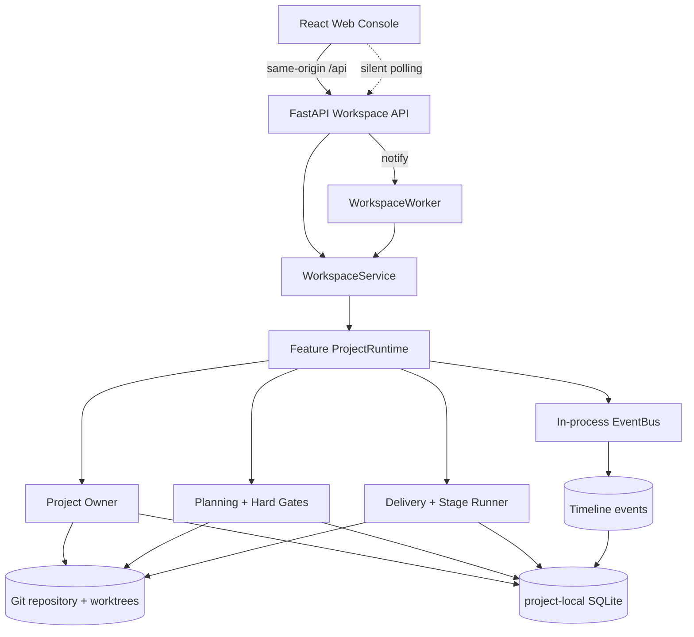
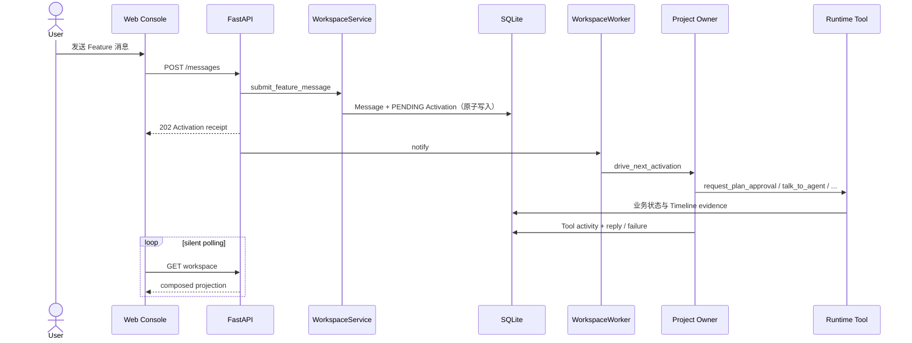
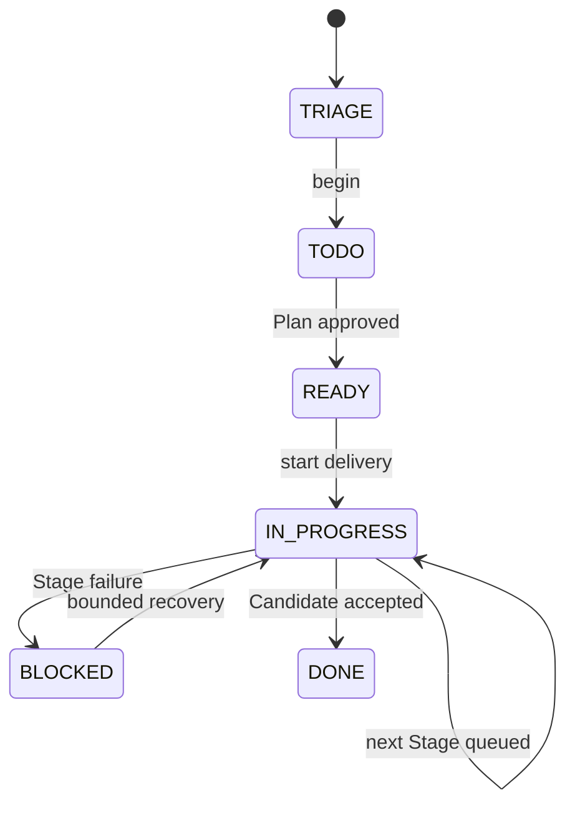
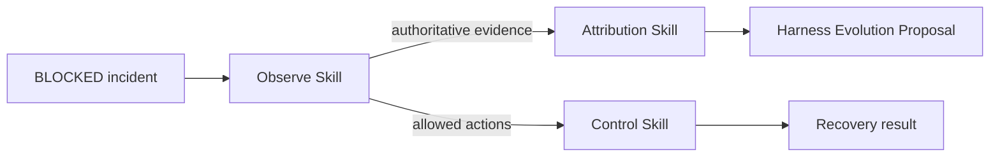

# AgentPanelX 架构

本文说明当前仓库已经实现的运行边界、读写路径和主要时序。Ultra Mode 的 Showcase 与生产化方向单独标注，避免把确定性演示数据当作真实 Runtime 执行。

## 1. 系统边界



### Web Console

React 页面只通过同源 `/api` 读取 Board 与 Workspace projection。FastAPI 可以在同一个 13475 端口同时提供构建后的 SPA 和 API；开发时 Vite 将 `/api` 代理到 FastAPI。

当前前端使用静默轮询而不是 SSE / WebSocket：仅在返回数据发生变化时更新 React state，因此不会因为定时请求反复清空页面或重建卡片。打开的 Workspace 可以比 Board 更频繁地刷新，Tool Step、Project Owner reply、Runtime、Plan 和 Timeline 都来自同一个组合读模型。

### Workspace

`WorkspaceService` 负责用户可见的项目注册、Feature worktree、Board 和 Workspace 操作。每个 Feature 绑定一个 managed Git worktree 和独立 Project Runtime；`WorkspaceWorker` 串行消费需要机器推进的 Activation 或 Delivery step，避免多个后台线程同时改变同一个 Feature。

### Project Runtime

`ProjectRuntimeService` 是显式命令协调层。它组合 Project Owner、Planning、Delivery、Runtime Context、EventBus 与查询投影，并保证：

- 用户消息与 durable Owner Activation 原子写入；
- Plan approve / reject、Delivery start / drive 都经过业务服务；
- 未完成 Activation 会阻止不安全的并发动作；
- 进程重启后，遗留的 RUNNING Activation 会被标记为明确失败，而不是永久显示为运行中；
- 开发者可以通过 `scripts/debug_tool_cli.py` 在不启动模型 ReAct loop 的情况下逐步执行真实 Tool Action。

### Git 与 SQLite

Git 承载代码、Plan commit、Feature branch、Candidate 等需要版本语义的事实；project-local SQLite 承载 Runtime Context、Message History、Owner Activation、Milestone Snapshot、Stage Run 和 Timeline。

`.agentplanex/` 会进入目标仓库私有的 `.git/info/exclude`，避免数据库、trajectory 和 transcript 被误加入业务 commit。Runtime 不允许通过直接写 SQLite 或 Git ref 来跳过 Service Contract。

## 2. Project Owner 消息时序



后端先返回 accepted receipt，再由后台 Worker 运行 Project Owner。即使模型网关失败，Activation 也会进入终态并形成可展示的失败事实；页面不会把没有发生的 Owner reply 伪造成成功回复。

## 3. Planning 与 Delivery



Plan 和完整 Milestone View 都有精确 subject digest。Reviewer 在隔离 workspace 中读取固定输入并返回结构化 manifest；digest 不匹配、输出不完整或 Reviewer 不可用时，Hard Gate fail closed。

Delivery 将一次运行拆成 durable Stage Run。Stage terminal fact、下一 Stage、Candidate commit 与后续 Owner Activation 都通过明确 Service 转换产生，Timeline 记录状态到达路径，而不是反向决定业务结果。

## 4. EventBus 与前端投影

当前 EventBus 是同步进程内分发器。业务服务在完成状态变化后发布 `ExecutionEvent`，SQLite Timeline handler 记录事件；handler 失败会被记录，但不会反转已经成功的业务决策。

EventBus 的职责是统一事实分发，不是直接把浏览器变成订阅者。当前 Web Console 采用分层静默轮询：

```text
Runtime command
  -> Service transaction
  -> EventBus / Timeline record
  -> Workspace read model
  -> silent polling detects changed payload
  -> React updates only changed state
```

如果未来切换为 SSE 或 WebSocket，稳定边界应是 Workspace projection / event cursor，而不是让每个领域服务直接维护浏览器连接。

## 5. BLOCKED、三个 Skill 与 Harness Evolution



- Observe 只读恢复 Runtime、Git、Plan、Milestone、Stage 与 Timeline 事实。
- Control 在用户授权范围内经过真实 Runtime 推进 Activation 或 Delivery，不直接修改存储。
- Attribution 先恢复 BLOCKED 检查点的权威证据，再 fork 只读 Historical Project Owner 进行质询与反思，最终形成统一 Proposal；它不负责解除阻塞。

当前仓库已提供三个 canonical Skill 和静态 Web Showcase。自动创建 Assistance Worker、自动应用 Proposal 并重放验证属于继续生产化方向；公开材料不应把这一方向描述成已经发生的外部执行。

## 6. 安全与运行限制

- Web host 只允许 `127.0.0.1` 或 `localhost`，当前不是云端多租户服务。
- Project Owner Bash 使用 Bubblewrap 限制持久写入范围并创建无网络 namespace；它仍可以读取部分宿主文件，因此不是保密沙箱。
- 模型凭据只从环境变量读取。
- 目标 Project 必须是有效 Git 仓库，并且指定 main branch 必须已有 commit。
- 删除 Feature 只移除 AgentPanelX 管理的非活动 worktree，保留 Git branch；真实项目和运行中 Feature 有显式保护。

## 7. 代码入口

| 关注点 | 入口 |
| --- | --- |
| Web API / SPA host | `src/agentplanex/web/app.py` |
| Workspace orchestration | `src/agentplanex/services/workspace.py` |
| Background driver | `src/agentplanex/services/workspace_worker.py` |
| Project Runtime coordination | `src/agentplanex/services/project_runtime.py` |
| Planning / Hard Gate | `src/agentplanex/services/planning.py`, `plan_hard_gate.py` |
| Delivery state machine | `src/agentplanex/services/delivery.py`, `delivery_runner.py` |
| Event distribution / Timeline | `src/agentplanex/services/event_bus.py`, `infrastructure/sqlite/timeline.py` |
| React pages | `frontend/src/pages/` |
| Deterministic Showcase | `frontend/src/showcase/data.ts`, `frontend/src/pages/ShowcasePage.tsx` |
