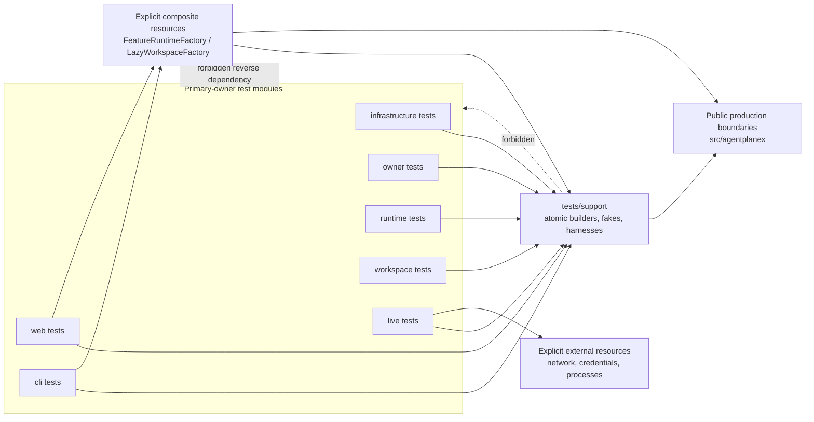
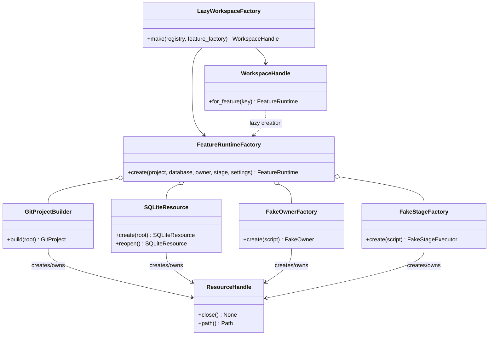
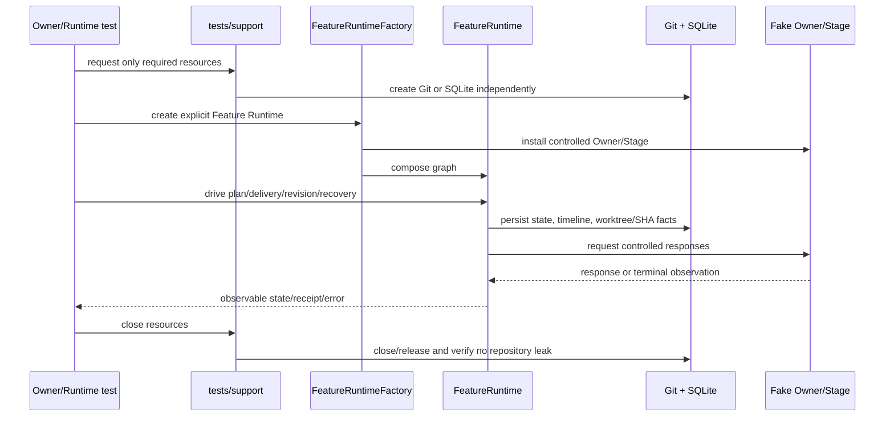
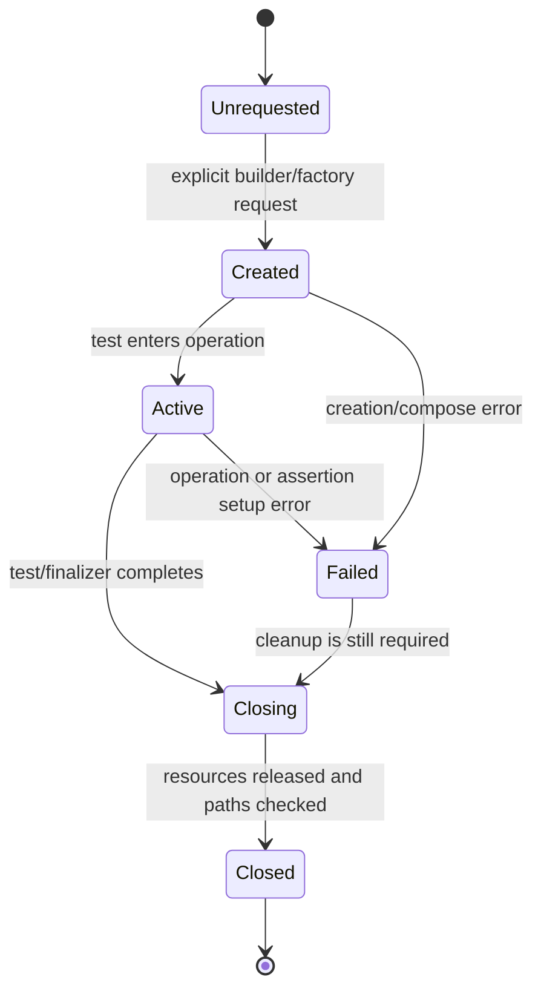

# 测试代码架构优化 Feature Architecture

> Status: Proposed canonical baseline; awaiting explicit Plan approval.
> Repository baseline inspected: `6850d72`.
> This document describes the test architecture, not a new production layering model.

## 1. Existing context and architectural change

当前测试架构的事实基线：

- `tests/conftest.py` 暴露 `initialize_git_project(tmp_path)`；
- `tests/fixtures/git_project.py` 的 `initialize_git_project()` 创建目录、Git 仓库、初始 commit，并调用 `initialize_project_database()` 创建 SQLite schema；
- `tests/runtime_support.py` 的 `compose_test_runtime()` 组装 Runtime 与 Control，`compose_test_executions()` 组装完整 command graph、context、planning 和 event bus；
- `pyproject.toml` 使用 `tests` 作为 testpaths、importlib 模式和默认 `-m=not live_model`，并声明 `unit`、`integration`、`e2e`、`project_owner_agent`、`live_model`、`slow` marker；
- 当前测试文件同时覆盖 Infrastructure、Owner、Runtime、Workspace、Web、CLI 和 Live 风险，混合文件不能按文件名整体归类。

现有问题是测试的业务证据、执行边界和资源生命周期被混合表达。提议的变化是：

1. 用平直 owner 目录表达 primary evidence owner；
2. 用 `tests/support` 表达共享、原子、可组合资源；
3. 用显式 composite resource 表达完整 Feature Runtime；
4. 用 lazy Workspace factory 避免声明即创建多个 Runtime；
5. 用 marker/命令表达 execution policy；
6. 用 ledger 和 old→new 映射治理迁移与清理。

这是测试代码架构，不是把生产系统改造成七层，也不是要求一次性创建七套 `conftest.py`。

## 2. Module ownership

### 2.1 Primary-owner test modules

| Module | Owns | Must not own |
|---|---|---|
| `tests/infrastructure/` | SQLite、Git、文件、Gateway、进程等独立能力契约 | 完整 Runtime 状态推进 |
| `tests/owner/` | Project Owner 思考、上下文、Tool 协议、恢复 | 仅为方便而创建完整项目 |
| `tests/runtime/` | 单 Feature 状态推进、Planning、Delivery、Recovery、Candidate revision 链 | 多 Feature 调度或入口路由 |
| `tests/workspace/` | Registry、绑定、调度、隔离和跨 Feature 投影 | 已由 Runtime 证明的单 Feature 状态规则 |
| `tests/web/` | HTTP/API、路由、序列化、投影和流入口 | 复制完整 Runtime 业务规则 |
| `tests/cli/` | 命令解析、安装、进程入口、退出码、重启和用户可见 CLI journey | 复制 Workspace/Runtime 状态证据 |
| `tests/live/` | 真实模型、网络、凭证或外部进程 smoke | 默认离线 fixture 或默认 pytest 入口 |

每个测试只有一个 primary owner。跨边界风险通过账本和测试说明记录，不建立第二套 owner 目录。

### 2.2 `tests/support/`

`tests/support/` 是共享测试支持层，负责：

- 原子 builders；
- fakes 和 controlled transports；
- 资源生命周期适配器；
- Web/CLI entry harness；
- 显式 composite resource 的装配辅助。

它不能依赖任何具体测试文件或 owner 目录，不能通过导入测试模块共享 fake，也不能隐藏重资源创建。

现有 `tests/fixtures/` 和 `tests/runtime_support.py` 可以渐进整理到该边界，但不能为了目录整齐而一次性重写所有 helper。

## 3. Interfaces and contracts

以下是目标测试架构的接口契约。具体 Python 名称可以在实现阶段细化，但语义和边界必须保持一致。

### 3.1 Atomic resource builders

```text
GitProjectBuilder.build(root: Path) -> GitProject
SQLiteResource.create(root: Path) -> SQLiteResource
FakeOwnerFactory.create(script: OwnerScript) -> FakeOwner
FakeStageFactory.create(script: StageScript) -> FakeStageExecutor
EntryHarness.start(...) -> RunningEntry
LiveGateway.connect(...) -> LiveGateway
```

不变量：

- 每个 builder 只创建自身负责的资源；
- 默认资源根是 pytest `tmp_path`；
- 所有可变资源默认 function scope；
- 子进程、HTTP server、Gateway 等必须提供明确关闭操作或 `yield` 生命周期；
- builder 失败时不得留下无法解释的仓库写入或后台进程。

特别地，Git builder 与 SQLite resource 可以分别请求。现有 `initialize_git_project()` 的复合行为可以作为 Feature 场景 builder 的内部组合，但不能作为所有测试的默认入口。

### 3.2 `FeatureRuntimeFactory`

```text
FeatureRuntimeFactory.create(
    project: GitProject,
    database: SQLiteResource,
    owner: FakeOwner,
    stage: FakeStageExecutor,
    settings: RuntimeSettings,
) -> FeatureRuntime
```

责任：显式组合单个 Feature 的 Git、SQLite、Owner/Stage fake 和 Runtime graph。

不变量：

- 只有测试明确需要跨资源或单 Feature Runtime 不变量时才创建；
- Candidate revision 必须能够观察 worktree/SHA、旧 run 关联、反馈传递、新 Candidate 和恢复事实；
- 不得把所有 Owner、Infrastructure 或配置测试都强制升级为 Feature Runtime。

失败行为：任何一个必要资源创建或组合失败时，factory 应让测试获得明确异常，并确保已经启动的可变资源按生命周期关闭。

### 3.3 `LazyWorkspaceFactory`

```text
LazyWorkspaceFactory.make(
    registry: WorkspaceRegistry,
    feature_builder: FeatureRuntimeFactory,
) -> WorkspaceHandle

WorkspaceHandle.for_feature(feature_key: str) -> FeatureRuntime
```

责任：先创建 Registry、binding 和 lazy factory；只有访问指定 Feature 时才创建该 Feature Runtime。

不变量：

- 声明 Workspace 不等于创建多个完整项目或数据库；
- 不同 Feature 的资源、状态和投影必须隔离；
- 请求不存在的 Feature 或重复创建冲突时，失败必须可观察且不能泄漏部分 Runtime。

### 3.4 Entry harness

```text
WebHarness.request(...) -> HttpResponse
CliHarness.run(argv: Sequence[str]) -> ProcessResult
```

Web/CLI harness 只负责入口适配、路由、序列化、进程隔离、重启和用户可见投影。状态规则的主要证据应留在 Runtime/Workspace，除非入口本身有独有风险。

### 3.5 Test value ledger

账本不是运行时模块，而是迁移治理接口：

```text
Ledger.record(nodeid, invariant, owner, boundary, resources, policy, evidence)
Ledger.map(old_nodeid, new_nodeid)
Ledger.set_disposition(nodeid, disposition, reason, replacement_evidence)
```

它必须能解释每次移动、拆分、参数化、合并和清理。账本不替代测试断言，也不允许在没有替代证据时批准删除。

## 4. Dependency direction



依赖规则：

- owner 测试可以依赖 `tests/support` 和被测生产公开边界；
- `tests/support` 不得反向依赖 owner 目录或具体测试文件；
- composite resource 只能组合原子资源和明确的生产接口；
- Web/CLI harness 不变成新的生产业务层；
- Live 资源必须显式请求，不进入默认 fixture 图；
- 禁止 test-to-test import 共享 fake。

## 5. Resource composition



图中 `FeatureRuntimeFactory` 是显式复合资源，不是根 autouse fixture；`LazyWorkspaceFactory` 延迟创建 Feature Runtime。每个资源的创建方、关闭方和失败清理必须在实现阶段的 fixture contract 中明确。

## 6. Runtime collaboration and lifecycle



Candidate revision 的 Runtime 证据必须保持：`revise → 保留原 Candidate/worktree/SHA → 新 StageRun 关联旧 run → 传递反馈 → 新 Candidate → accept 或恢复`。不能用一个输入 schema 测试替代整条不变量链。

## 7. Resource lifecycle state



禁止的状态包括：未请求资源却自动创建、关闭后继续使用、失败后遗留后台进程、或资源写入仓库而没有账本/测试证据。

## 8. Alternatives and trade-offs

| Alternative | Decision | Trade-off |
|---|---|---|
| 只修改 pytest 入口 | Reject | 不能解决 owner、资源和重复 setup 混合 |
| `unit/integration/e2e/live × owner` 二维目录 | Reject | 目录爆炸，执行政策重复表达 |
| 七个 owner 目录配七套万能 `conftest.py` | Reject | 会复制 fixture 并机械搬迁混合文件 |
| 按文件名整体迁移 | Reject | 混合文件内部有不同不变量和失败模式 |
| 平直七 owner + `tests/support` + 显式 composite + lazy Workspace | Adopt as proposal | 迁移可逆、依赖简单，但需要账本和 hardening 防止新层变成万能层 |
| 未来将 Web/CLI 收入 `entrypoints/` | Defer | 可能减少目录，但当前不是阻塞问题 |

## 9. Architecture risks and unresolved decisions

- 混合测试必须按断言拆分，不能预先按文件名确定 owner；
- 现有 `initialize_git_project()` 的复合便利性可能诱使新 fixture 再次隐藏 Git/SQLite 依赖；
- `compose_test_executions()` 组合的 Runtime graph 很有价值，但不能扩散成所有 Owner/Infrastructure 测试的默认资源；
- 现有 marker 的实际使用需要 M1 证据，不能提前删除或重命名；
- 绝对 VENV 路径适合当前 AgentPlaneX 执行环境，但 CI 兼容策略尚未决定；
- 如果不得不修改生产 seam，必须返回 requirements/用户决策，不应在测试迁移中偷偷加入；
- 如果 M1 证明七目录不是稳定边界，Owner 应允许修改架构和 roadmap，而不是为了符合初始草案强行迁移。

## 10. Review record

- Planner advisory review：已完成，建议已被 Owner 部分采纳；Planner 输出仍不构成用户批准。
- 当前 canonical architecture：Proposed，等待 Plan approval。
- 任何架构变更必须重新检查仓库证据、咨询 Planner，并记录 accepted trade-off 或 unresolved decision。
